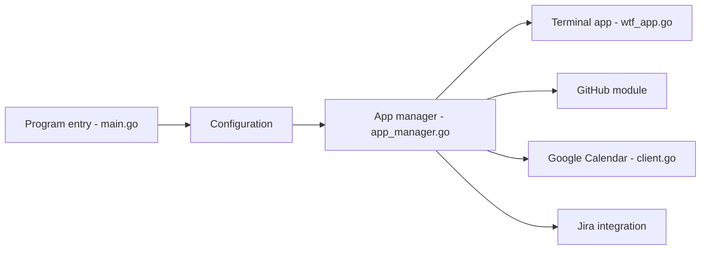

# wtfutil/wtf

> Tableau de bord personnel en terminal, à modules configurables (GitHub, calendrier, Jira…), pour développeurs.

## Le problème
Garder sous les yeux, au même endroit, des informations utiles mais rarement consultées.

## Ce que ça fait vraiment
Binaire Go construit sur tcell et tview. Un fichier `config.yml` active des modules (DigitalOcean, GitHub, Google Calendar, Hacker News, Have I Been Pwned, New Relic, OpsGenie, Security, Transmission, Trello) dont les clients interrogent des services externes. Le projet annonce un renommage en Tessera avant la v1.0.

## Comment c'est branché


## Essayer
```bash
brew install wtfutil
wtfutil
go install github.com/wtfutil/wtf@latest
```

## Coût et pièges
Gratuit. Chaque module demande ses propres identifiants de service. Maintenu informellement par des bénévoles, sans garantie de correctif (le README le dit).

## Ce que ce n'est pas
Pas un outil de supervision ni de data science. Licence MPL-2.0 (copyleft faible, par fichier).

## Alternatives
Aucune alternative nommée dans le README (tiny-care-terminal est cité comme inspiration).

## Pour toi
À ignorer : gadget de productivité sans lien avec le travail data/IA/MLOps, et projet en transition.

