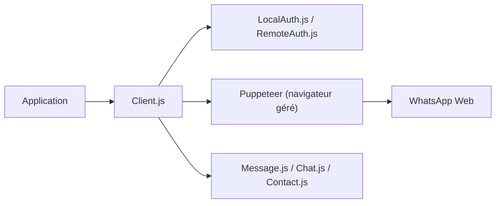

# wwebjs/whatsapp-web.js

> Bibliothèque Node.js qui pilote WhatsApp Web via Puppeteer, pour bâtir un robot ou une API WhatsApp non officielle.

## Le problème
Pas d'accès simple à WhatsApp depuis du code sans passer par l'offre officielle. Il faut automatiser le client web pour lire et envoyer des messages.

## Ce que ça fait vraiment
Un `Client` lance un navigateur géré par Puppeteer, charge WhatsApp Web et appelle ses fonctions internes. Il émet des événements (`qr`, `ready`, `message`) et convertit les résultats en objets typés : chats, contacts, messages, médias, groupes, canaux, sondages. L'authentification se fait par QR code, avec des stratégies de session locale (`LocalAuth`) ou distante (`RemoteAuth`).

## Comment c'est branché


## Essayer
```bash
npm install whatsapp-web.js
yarn add whatsapp-web.js
pnpm add whatsapp-web.js
```
Le README fournit ensuite un exemple JS (`client.on('qr', …)`, `client.initialize()`), non reproduit ici.

## Coût et pièges
Node.js 18 ou plus requis. Un compte WhatsApp et un scan de QR sont nécessaires. Le README avertit que WhatsApp interdit les clients non officiels : le blocage du compte n'est pas exclu.

## Ce que ce n'est pas
Ce n'est pas l'API officielle de WhatsApp et le projet n'est affilié à personne chez WhatsApp. Il n'offre aucune garantie de continuité si WhatsApp Web change. Le README ne mentionne aucun usage IA.

## Alternatives
Aucune alternative citée dans le README.

## Pour toi
Surveiller : utile pour un prototype de notification ou de chatbot, mais le risque de blocage et la dépendance à un service tiers le réservent à l'expérimentation.

