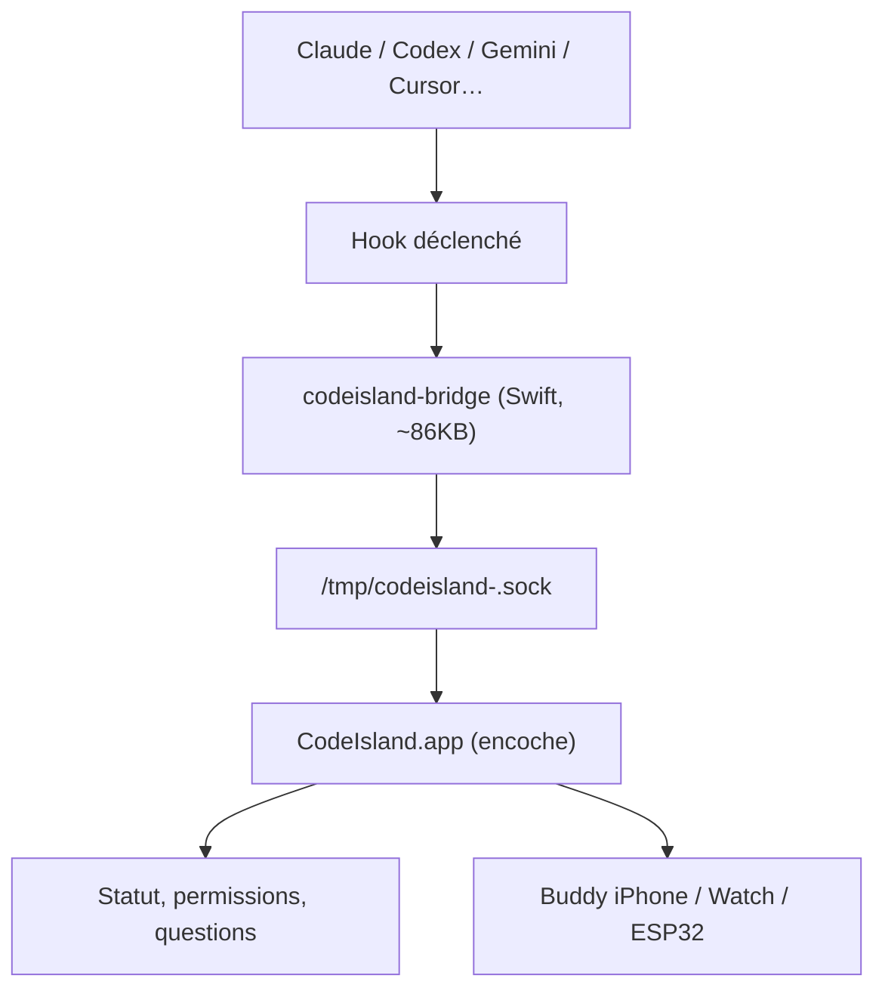

# wxtsky/CodeIsland

> Panneau d'état temps réel des agents de code, logé dans l'encoche du MacBook.

## Le problème
Savoir si Claude attend une validation ou si Codex a fini oblige à changer de fenêtre en
permanence.

## Ce que ça fait vraiment
Installe des hooks légers dans la configuration de 15 outils (Claude Code, Codex, Grok CLI,
Gemini CLI, Cursor, Copilot, Trae, Qoder, Factory, CodeBuddy, OpenCode, Kimi Code CLI, Cline,
Pi / Oh My Pi, DeepSeek Harness). Chaque événement passe par un binaire Swift
`codeisland-bridge` (~86 Ko) puis une socket Unix `/tmp/codeisland-<uid>.sock` ; l'app met à
jour l'encoche instantanément. On approuve ou refuse une permission depuis le panneau, on
répond aux questions de l'agent, on saute vers l'onglet de terminal ou la fenêtre d'IDE
concernée. Miroir optionnel vers iPhone, Apple Watch et un écran ESP32 en BLE.

## Comment c'est branché


## Essayer
```bash
brew tap wxtsky/tap
brew install --cask codeisland
git clone https://github.com/wxtsky/CodeIsland.git
swift build && ./.build/debug/CodeIsland
./build.sh
dsh plugin --profile <profile> add github:cdxiaodong/dsh-island
```

## Coût et pièges
Gratuit, mais **macOS 14+ uniquement** et Swift 5.9+ pour compiler. Au premier lancement macOS
affiche un avertissement de sécurité à lever dans Réglages → Confidentialité. Pour Codex il
faut en plus lancer `/hooks` et approuver manuellement les entrées, sinon rien ne se passe
sans message d'erreur. Le Buddy iPhone demande les permissions Réseau local et Bluetooth. La
doc du montage ESP32 est en chinois.

## Ce que ce n'est pas
Ce n'est pas un gestionnaire d'agents : il affiche et relaie des approbations, il ne lance ni
n'orchestre rien. Ce n'est pas multiplateforme. L'encoche n'est pas obligatoire mais c'est le
cas d'usage visé.

## Alternatives
- claude-island de @farouqaldori, cité comme l'inspiration originale.

## Pour toi
Sans intérêt sous Linux/WSL ; joli confort si ton poste principal est un MacBook à encoche.
