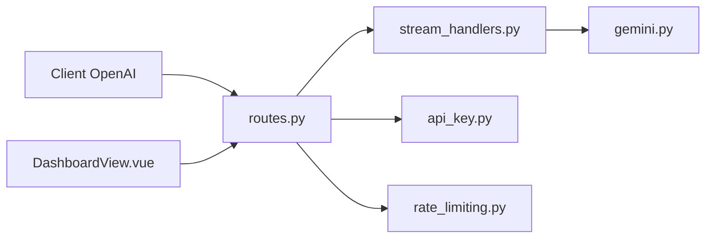

# wyeeeee/hajimi

> Proxy FastAPI qui expose les modèles Gemini via une API compatible OpenAI, pensé pour l'hébergement gratuit.

## Le problème
Les clients qui parlent le format OpenAI ne peuvent pas utiliser directement les clés Gemini, et une seule clé atteint vite son quota.

## Ce que ça fait vraiment
Traduit les requêtes `/v1/chat/completions` vers Gemini (texte, fichiers, images, appels de fonction, flux). Fait tourner plusieurs clés Gemini en rotation, limite le débit par minute et par IP, propose un mode Vertex AI, un cache de réponses, un « faux flux » (keep-alive pendant une requête non streamée), une recherche web via suffixe `-search` et un tableau de bord Vue. Un mode « déguisement » ajoute une chaîne aléatoire aux messages pour éviter d'être repéré comme automate.

## Comment c'est branché


## Essayer
```bash
pip install -r requirements.txt
uvicorn app.main:app --host 0.0.0.0 --port 7860
# ou image : ghcr.io/wyeeeee/hajimi:latest
```

## Coût et pièges
Clés Gemini à ta charge et quotas à surveiller. Le mot de passe par défaut est « 123 » : à changer. Dépôt archivé, dernier push en septembre 2025 : plus de correctifs.

## Ce que ce n'est pas
Pas un produit maintenu : archivé. Les options de « déguisement » visent à contourner la détection d'automatisation, ce qui peut contrevenir aux conditions du fournisseur. Pas de licence identifiée par GitHub.

## Alternatives
Aucune alternative nommée dans le README.

## Pour toi
À ignorer : archivé, licence non identifiée et fonctionnalités de contournement ; passe plutôt par l'API officielle ou un proxy maintenu.

