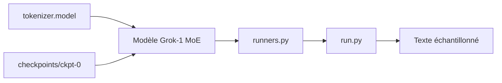

# xai-org/grok-1

> Code JAX d'exemple pour charger et échantillonner les poids ouverts du LLM Grok-1 (314B).

## Le problème
Sans code de référence, des poids MoE de 314 milliards de paramètres sont inexploitables.

## Ce que ça fait vraiment
`run.py` charge le checkpoint `ckpt-0` et échantillonne sur une entrée de test.
Modèle : MoE 8 experts (2 actifs par token), 64 couches, contexte 8 192 tokens, tokenizer SentencePiece 131 072.
Couche MoE volontairement non optimisée (pas de kernels custom), pour valider la correction.
Poids par torrent ou Hugging Face.

## Comment c'est branché


## Essayer
```bash
git clone https://github.com/xai-org/grok-1.git && cd grok-1
pip install huggingface_hub[hf_transfer]
huggingface-cli download xai-org/grok-1 --repo-type model --include ckpt-0/* --local-dir checkpoints --local-dir-use-symlinks False
pip install -r requirements.txt
python run.py
```

## Coût et pièges
Machine multi-GPU avec énormément de mémoire indispensable. Dernier push en août 2024.

## Ce que ce n'est pas
Pas un moteur d'inférence efficace ni un modèle instruit documenté ; pas de fine-tuning fourni.

## Alternatives
Non documenté.

## Pour toi
Curiosité historique ; hors de portée matérielle et sans intérêt pratique aujourd'hui.
