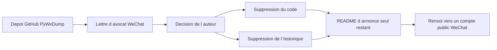

# xaoyaoo/PyWxDump

> **Emptied repository.** A former WeChat-related tool, removed by its author after a legal notice.

## The problem

The original problem is no longer documented: the README describes no feature at all any more. What
remains documents a different, very real problem — a repository with 9,664 stars can vanish
overnight for legal reasons, taking its code and its entire commit history with it.

## What it actually does

Nothing. The repository now holds a single notice dated 20 October 2025. The author states that he
received a lawyer's letter from WeChat pointing at compliance risk in the project's core
functionality, and that he consequently deleted all of the code along with the commit history. He
spells out that there is no download, no documentation, no precompiled program, and no support,
update or security fix. He also asks the parties named in the letter to stop using the project,
delete local copies, and take down online promotional material.

## How it is wired



There is no technical architecture left to describe: the only documented chain runs from the legal
notice to the deletion of the repository. The README names no source file, no module, no entry
point. The last node is the WeChat public account "逍遥之芯" to which the author redirects the
community, while announcing he will no longer cover WeChat-related topics there.

## Trying it

```
No documented command: the repository no longer contains code or installation instructions.
```

The README offers no command, no `pip install`, no download link. Nothing can be reconstructed
without inventing it.

## Cost and traps

The cost here is legal, not technical. The author writes that keeping using an old local copy may
lead to compliance disputes or legal risk, and that the consequences are the user's own. No license
is declared on the repository, so even copies already fetched have no clear basis for use. Practical
trap: forks and mirrors still online inherit exactly the same problem.

## What it is not

It is no longer a tool: it is an announcement page. It is not a merely dormant project one could
pick up either — the code and history were erased, not archived. And it is not a temporary pause:
the README frames it as an ending, with no announced return.

## Alternatives

The README names no comparable project, and no catalogue neighbours were provided for this
repository. No comparable alternative in the catalogue can therefore be cited without inventing
one. The only pointer in the text is the author's WeChat public account, which is not software.

## For you

Ignore it. There is nothing to evaluate or install, and keeping an old copy carries a legal risk the
author explicitly spells out. The residual value is as a reminder: vendor or pin the critical
dependencies of a pipeline, because a repository with nearly ten thousand stars can evaporate
overnight.
