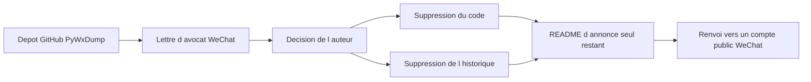

# xaoyaoo/PyWxDump

> **Dépôt vidé.** Ancien outil autour de WeChat, retiré par son auteur après une mise en demeure.

## Le problème

Le problème d'origine n'est plus documenté : le README ne décrit plus aucune fonctionnalité. Ce
qui reste décrit un autre problème, bien réel : un dépôt populaire (9 664 étoiles) peut disparaître
du jour au lendemain pour raison juridique, emportant code et historique de commits.

## Ce que ça fait vraiment

Plus rien. Le dépôt ne contient qu'un fichier d'explication daté du 20 octobre 2025. L'auteur y
indique avoir reçu une lettre d'avocat de WeChat pointant un risque de conformité sur les
fonctions centrales du projet, et avoir en conséquence supprimé la totalité du code ainsi que
l'historique des commits. Il précise qu'il n'y a plus de téléchargement possible, plus de
documentation, plus de binaire précompilé, et aucun support, mise à jour ou correctif de sécurité.
Il demande explicitement aux parties visées par la lettre de cesser tout usage, de supprimer les
copies locales et de retirer les contenus de promotion en ligne.

## Comment c'est branché



Il n'y a pas d'architecture technique à décrire : le seul enchaînement documenté est celui de la
mise en demeure vers la suppression du dépôt. Le README ne nomme aucun fichier de code, aucun
module, aucun point d'entrée. Le dernier nœud correspond au compte public « 逍遥之芯 » vers lequel
l'auteur redirige la communauté, en annonçant qu'il n'y parlera plus de sujets liés à WeChat.

## Essayer

```
Aucune commande documentée : le dépôt ne contient plus ni code, ni instructions d'installation.
```

Le README ne fournit aucune commande, aucun `pip install`, aucun lien de téléchargement. Rien ne
peut être reconstruit sans inventer.

## Coût et pièges

Le coût n'est pas technique mais juridique. L'auteur écrit que continuer à utiliser une ancienne
copie locale peut exposer à des litiges de conformité ou à un risque légal, et que les conséquences
sont à la charge de l'utilisateur. Aucune licence n'est déclarée sur le dépôt, ce qui retire toute
base d'usage claire même pour les copies déjà récupérées. Piège pratique : les forks et miroirs
restés en ligne héritent du même problème.

## Ce que ce n'est pas

Ce n'est plus un outil : c'est une page d'annonce. Ce n'est pas non plus un projet simplement
inactif que l'on pourrait reprendre — le code et l'historique ont été effacés, pas archivés. Et ce
n'est pas une suspension temporaire : le README parle d'une fin, sans reprise annoncée.

## Alternatives

Le README ne nomme aucun projet comparable, et aucun voisin de catalogue n'a été fourni pour ce
dépôt. Aucune alternative comparable dans le catalogue ne peut donc être citée sans invention. Le
seul renvoi du texte est un compte public WeChat de l'auteur, qui n'est pas un logiciel.

## Pour toi

À ignorer. Il n'y a rien à évaluer, ni à installer, et conserver une copie ancienne présente un
risque juridique explicitement rappelé par l'auteur. L'intérêt résiduel est de tenir cet exemple en
tête comme rappel : vendoriser ou figer les dépendances critiques d'un pipeline, car un dépôt de
près de dix mille étoiles peut s'évaporer en une nuit.
