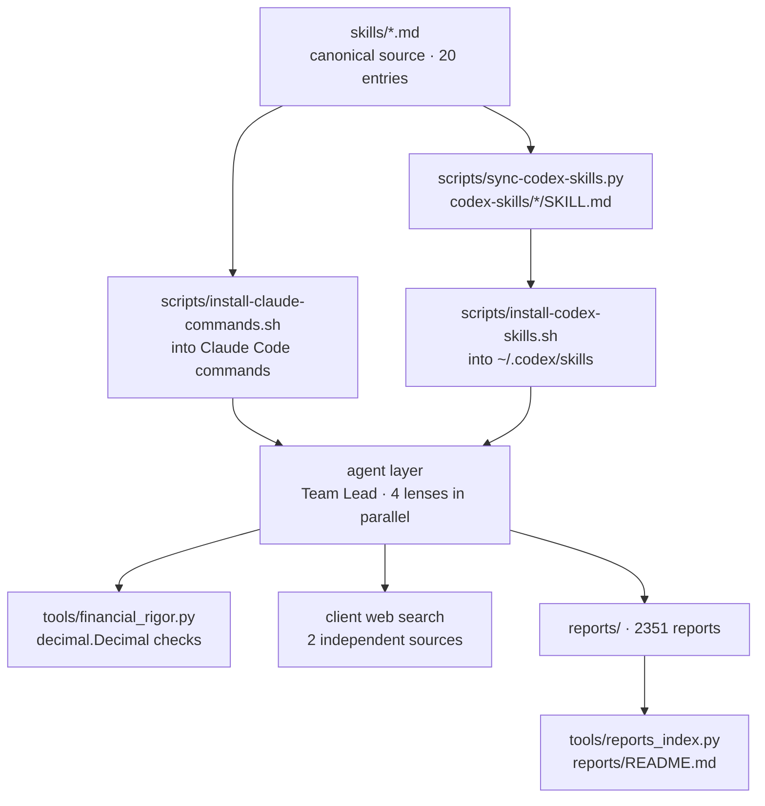

# xbtlin/ai-berkshire

> **Twenty investment-research commands to install into Claude Code or Codex, plus their reports.**

## The problem

Asking an assistant directly whether a stock is worth buying returns, as the README puts it, a
balanced "on the one hand... on the other hand..." piece that ends with "investing carries
risk, judge for yourself". The format, depth and coverage change every time, so nothing is
comparable across companies. There is also a mechanical problem: an LLM's arithmetic is
unreliable, and one misplaced decimal in a PE ratio, or a market cap confused between Hong
Kong dollars and yuan, is enough to skew a decision.

## What it actually does

The repository is a collection of 20 markdown skills kept in three parallel file sets:
`skills/*.md` as the canonical source for Claude Code commands, `codex-skills/*/SKILL.md`
generated by `scripts/sync-codex-skills.py`, and `codex-prompts/*.md` as an optional
compatibility layer. Entries are grouped by use: deep research (`/investment-research`,
`/investment-team`, `/management-deep-dive`), earnings reading (`/earnings-review`,
`/earnings-team`), sector screening (`/quality-screen`, `/industry-funnel`,
`/bottleneck-hunter`), portfolio work (`/portfolio-review`, `/thesis-tracker`,
`/thesis-drift`), and thinking tools (`/dyp-ask`, `/wechat-article`).

The stance is methodological: four investor lenses (Buffett, Munger, Duan Yongping, Li Lu) set
up to contradict each other, a forced verdict (pass / fail / grey zone) with price bands, an
A/B/C rating of how rich the available information is, and an eight-item red-line list that
vetoes outright. `/investment-team` runs four agents in parallel on one company, with a Team
Lead synthesising afterwards. The repo also ships 2351 reports produced with the framework,
indexed in `reports/README.md` by `tools/reports_index.py`.

## How it is wired

No code-derived diagram exists for this repository: the sketch below is rebuilt from the
README alone, from the three layers it declares and the file paths it names.



## Try it

The README gives the Claude Code path, copied here as written:

```bash
npm install -g @anthropic-ai/claude-code
git clone https://github.com/xbtlin/ai-berkshire.git
cd ai-berkshire
./scripts/install-claude-commands.sh
```

Windows (`.\scripts\install-claude-commands.bat`) and Codex
(`./scripts/install-codex-skills.sh` after `npm install -g @openai/codex`) variants are also
documented. Once installed, calls are direct: `/investment-research 腾讯`,
`/quality-screen 恒生指数成分股`, `/news-pulse 腾讯`. The calculation tool is invoked separately,
for example `python3 tools/financial_rigor.py verify-market-cap --price 510 --shares 9.11e9
--reported 4.65e12 --currency HKD`.

## Cost and traps

- **Token spend is the real cost.** The README says so plainly: deep-research skills chain
  several rounds, cross-validation and multiple agents. The maintainer recommends the strongest
  model for high-stakes calls, and controlling cost by starting with `/quality-screen` or
  `/news-pulse` before `/investment-research`.
- **The README suggests `claude --dangerously-skip-permissions`** to avoid repeated tool
  approvals. That switches off tool-approval protection and should not be adopted by default.
- **The repo depends entirely on a third-party client** (Claude Code or Codex) and on that
  client's web search. Without a subscription or key, only markdown files remain.
- **The stated returns are screenshots** from a brokerage account (+69.29% in 2024, +66.38% in
  2025), unaudited, with the README's own disclaimer that past returns do not predict future
  ones. The repo also states it is not investment advice.
- **Single author**, tied to a WeChat public account that carries the curated part of the work;
  the repo is presented as the full framework, the editorial selection lives elsewhere.

## What it is not

- **Not software**: no package, no service, no API. These are structured markdown prompts plus
  one Python script for arithmetic verification.
- **Not a financial data source.** The README lists real-time access (Wind, Bloomberg, Yahoo
  Finance over MCP) as an unchecked future direction. Data comes from the client's web search,
  under a two-independent-sources rule.
- **Not an automatic decision system** and not a backtest: comparing reports against actual
  price performance is also a future direction. The price bands in the examples are report
  outputs, not validated recommendations.
- **Not English-first**: README, skills and reports are in Chinese, centred on Hong Kong,
  mainland China and US listings.

## Alternatives

No comparable alternative in the catalogue: the lexical neighbours offered
(`zhayujie/CowAgent`, `liyupi/ai-guide`, `affaan-m/ECC`, `sleuth-io/sx`) are not investment
skill collections. The only comparison the README itself names is `/deep-research`, the
orchestrator built into the Claude Code client — not shipped by this repo, and which the README
suggests running first to check a key fact before launching the sector skills.

## For you

Worth reading more than adopting: the transferable value is the prompt structure — a forced
verdict, the A/B/C information-richness rating, veto checklists, deliberate conflict between
several lenses, and the principle of moving arithmetic out of the LLM into `decimal.Decimal`.
Those patterns carry over to any analysis skill, finance or not. As an investing tool, the
barriers are the language, the dependence on a third-party client, and a token bill the README
never quantifies.
