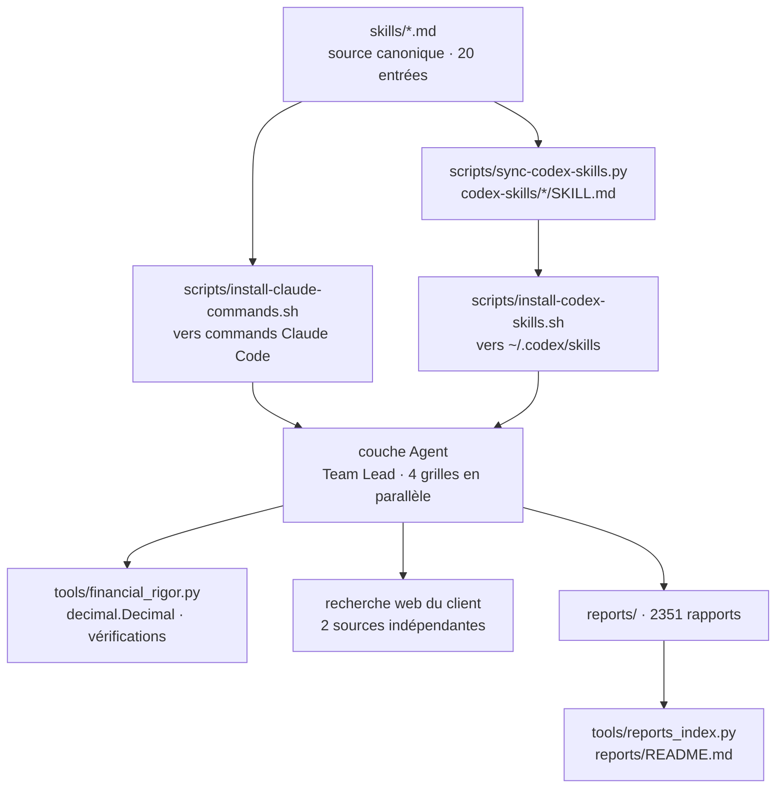

# xbtlin/ai-berkshire

> **Vingt commandes d'analyse financière à installer dans Claude Code ou Codex, plus leurs rapports.**

## Le problème

Demander directement à un assistant « est-ce que cette action vaut le coup » renvoie, dit le
README, une analyse équilibrée « d'une part… d'autre part… » qui finit par « investir comporte
des risques ». Le format change à chaque fois, la profondeur aussi, et rien n'est comparable
d'une entreprise à l'autre. S'ajoute un problème mécanique : le calcul mental d'un LLM est peu
fiable, et une PE mal arrondie ou une capitalisation confondue entre dollars de Hong Kong et
yuans suffit à fausser une décision.

## Ce que ça fait vraiment

Le dépôt est une collection de 20 skills en markdown, maintenue en trois jeux de fichiers :
`skills/*.md` comme source canonique pour les commandes Claude Code, `codex-skills/*/SKILL.md`
générés par `scripts/sync-codex-skills.py`, et `codex-prompts/*.md` en couche de compatibilité.
Les entrées sont rangées par usage : recherche approfondie (`/investment-research`,
`/investment-team`, `/management-deep-dive`), lecture de résultats trimestriels
(`/earnings-review`, `/earnings-team`), filtrage sectoriel (`/quality-screen`,
`/industry-funnel`, `/bottleneck-hunter`), suivi de portefeuille (`/portfolio-review`,
`/thesis-tracker`, `/thesis-drift`), outils de pensée (`/dyp-ask`, `/wechat-article`).

Le parti pris est méthodologique : quatre grilles d'investisseurs (Buffett, Munger, Duan
Yongping, Li Lu) censées se contredire, un verdict imposé (passe / ne passe pas / zone grise)
avec fourchettes de prix, une notation de la richesse d'information en A/B/C, une liste de
huit lignes rouges éliminatoires. `/investment-team` lance quatre agents en parallèle sur la
même entreprise, un Team Lead synthétisant ensuite. Le dépôt contient aussi 2351 rapports
produits avec le framework, indexés dans `reports/README.md` par `tools/reports_index.py`.

## Comment c'est branché

Aucun diagramme tiré du code n'existe pour ce dépôt : ce schéma est reconstruit depuis le
README, d'après les trois couches qu'il déclare et les chemins de fichiers qu'il nomme.



## Essayer

Le README donne l'installation côté Claude Code, en deux commandes copiées telles quelles :

```bash
npm install -g @anthropic-ai/claude-code
git clone https://github.com/xbtlin/ai-berkshire.git
cd ai-berkshire
./scripts/install-claude-commands.sh
```

Variantes Windows (`.\scripts\install-claude-commands.bat`) et Codex
(`./scripts/install-codex-skills.sh` après `npm install -g @openai/codex`) sont fournies. Une
fois installé, l'appel est direct : `/investment-research 腾讯`, `/quality-screen 恒生指数成分股`,
`/news-pulse 腾讯`. Les outils de calcul s'appellent séparément, par exemple
`python3 tools/financial_rigor.py verify-market-cap --price 510 --shares 9.11e9 --reported 4.65e12 --currency HKD`.

## Coût et pièges

- **La consommation de tokens est le vrai coût.** Le README l'assume : les skills de recherche
  approfondie enchaînent plusieurs tours, des vérifications croisées et plusieurs agents. Le
  mainteneur recommande le modèle le plus capable pour les décisions à enjeu, et de contrôler
  le coût en commençant par `/quality-screen` ou `/news-pulse` avant `/investment-research`.
- **Le README suggère `claude --dangerously-skip-permissions`** pour éviter les validations
  répétées d'outils. C'est la désactivation de l'approbation des appels d'outils : à ne pas
  reprendre par défaut.
- **Le dépôt dépend entièrement d'un client tiers** (Claude Code ou Codex) et de la recherche
  web de ce client. Sans abonnement ni clé, il ne reste que des fichiers markdown.
- **Les performances affichées sont des captures d'écran** d'un compte de courtage (+69,29 % en
  2024, +66,38 % en 2025), non auditées, avec l'avertissement du README lui-même : le passé ne
  prédit pas l'avenir. Le dépôt indique aussi ne constituer aucun conseil en investissement.
- **Un seul auteur**, adossé à un compte WeChat public où paraît la partie « sélectionnée » du
  travail ; le dépôt est présenté comme le framework complet, l'éditorialisation est ailleurs.

## Ce que ce n'est pas

- **Ce n'est pas un logiciel** : aucun paquet, aucun service, aucune API. Ce sont des prompts
  structurés en markdown plus un script Python de vérification arithmétique.
- **Ce n'est pas une source de données financières.** Le README place l'accès temps réel
  (Wind, Bloomberg, Yahoo Finance via MCP) dans les pistes futures, non cochées. Les données
  viennent de la recherche web du client, avec une règle de deux sources indépendantes.
- **Ce n'est pas un système de décision automatique** ni un backtest : la comparaison rapports
  contre cours réels figure aussi dans les pistes futures. Les fourchettes de prix des exemples
  sont des sorties de rapport, pas des recommandations validées.
- **Ce n'est pas francophone** : README, skills et rapports sont en chinois, centrés sur des
  titres de Hong Kong, Chine continentale et États-Unis.

## Alternatives

Aucune alternative comparable dans le catalogue : les voisins lexicaux proposés
(`zhayujie/CowAgent`, `liyupi/ai-guide`, `affaan-m/ECC`, `sleuth-io/sx`) ne sont pas des
collections de skills d'analyse financière. Le seul point de comparaison nommé par le README
est `/deep-research`, l'orchestrateur intégré au client Claude Code — non distribué par ce
dépôt, et que le README recommande d'utiliser en amont pour vérifier un fait clé avant de
lancer les skills sectoriels.

## Pour toi

À lire plus qu'à adopter : la valeur transférable est la structure de prompt — verdict imposé,
notation A/B/C de la richesse d'information, listes éliminatoires, conflit délibéré entre
plusieurs grilles, et le principe de sortir l'arithmétique du LLM vers `decimal.Decimal`. Ces
motifs se reprennent dans n'importe quel skill d'analyse, hors finance. Comme outil
d'investissement, la barrière est la langue, la dépendance au client tiers et la facture de
tokens que le README ne chiffre pas.
