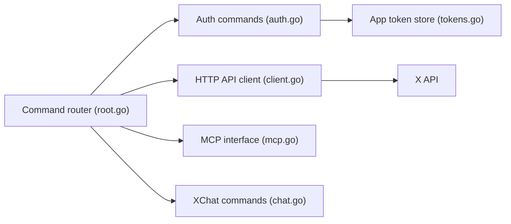

# xdevplatform/xurl

> Client en ligne de commande, façon curl, pour l'API de X, avec OAuth, MCP et messagerie chiffrée.

## Le problème
Appeler l'API de X exige de gérer OAuth 1.0a, OAuth 2.0 PKCE et plusieurs applications avec leurs jetons.

## Ce que ça fait vraiment
Enregistre plusieurs applications X, obtient et rafraîchit les jetons (stockés dans `~/.xurl/auth.yml`) et envoie des requêtes avec en-têtes, méthode et corps. Détecte les points de flux en continu, téléverse des médias par morceaux, lance un webhook temporaire via ngrok et affiche un jeton (`xurl token`). `xurl mcp` fait pont vers le serveur MCP de l'API X ; `xurl chat` est un client XChat chiffré de bout en bout, dont les clés doivent déjà exister.

## Comment c'est branché


## Essayer
```bash
brew install --cask xdevplatform/tap/xurl
xurl auth apps add my-app --client-id YOUR_CLIENT_ID --client-secret YOUR_CLIENT_SECRET
xurl auth oauth2 --app my-app
xurl /2/users/me
```

## Coût et pièges
Compte développeur X et application nécessaires ; le README indique qu'il faut passer l'app en « Pay-per-use » et en production sinon les lectures `/2/*` échouent. Les jetons sont stockés en clair dans un fichier YAML. `chat` n'existe que sur macOS et Linux amd64.

## Ce que ce n'est pas
Pas un client X généraliste pour lire son fil : c'est un outil d'API pour développeurs. Pas gratuit côté plateforme.

## Alternatives
Aucune alternative nommée dans le README.

## Pour toi
À surveiller : utile si tu collectes des données X ou branches un agent MCP dessus, mais l'accès payant à l'API en limite l'intérêt.

