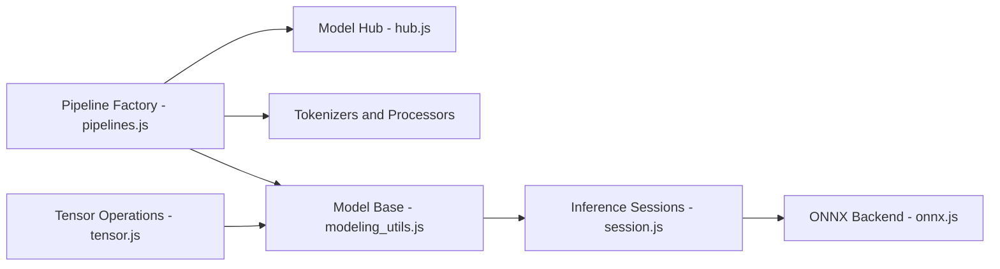

# xenova/transformers.js

> Exécute des modèles Hugging Face directement dans le navigateur ou en Node, via ONNX Runtime, sans serveur.

## Le problème
Faire de l'inférence NLP, vision ou audio côté client sans déployer de backend Python.

## Ce que ça fait vraiment
Reprend l'API `pipeline` de la bibliothèque Python `transformers` : tâches de texte, vision, audio et multimodal (classification, QA, résumé, détection d'objets, ASR, TTS, embeddings). Tourne en WASM sur CPU par défaut ou en WebGPU, avec quantification choisie par `dtype` (fp32, fp16, q8, q4). Les modèles PyTorch/TF/JAX se convertissent en ONNX avec Optimum. Un paquet de sorties structurées (JSON, regex) existe aussi.

## Comment c'est branché


## Essayer
```bash
npm i @huggingface/transformers
```
```javascript
import { pipeline } from '@huggingface/transformers';
const pipe = await pipeline('sentiment-analysis');
const out = await pipe('I love transformers!');
```

## Coût et pièges
Gratuit. Par défaut, modèles et binaires WASM viennent de CDN distants ; `env.allowRemoteModels = false` et `env.localModelPath` permettent de rester hors ligne. WebGPU encore expérimental dans de nombreux navigateurs. Certaines tâches ne sont pas prises en charge (tabulaire, texte-vers-image).

## Ce que ce n'est pas
Pas un équivalent complet de la bibliothèque Python : seuls les modèles convertis en ONNX tournent. Pas adapté aux très gros modèles côté navigateur.

## Alternatives
- Bibliothèque Python `transformers` : plus complète, côté serveur.
- Optimum : conversion de vos modèles vers ONNX.

## Pour toi
À adopter pour des démos ou de l'inférence embarquée sans serveur (embeddings, classification légère) : mêmes concepts que `transformers`, déploiement très simple.

