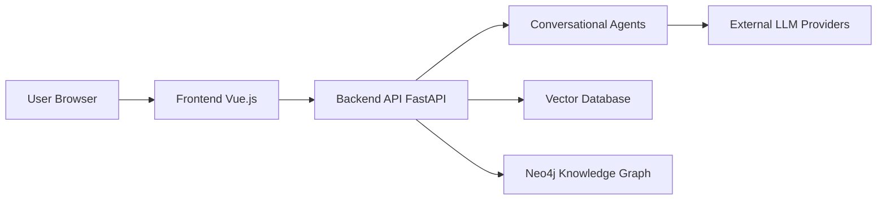

# xerrors/Yuxi-Know

> Plateforme d'agents et de RAG multi-utilisateurs à auto-héberger, pour équipes voulant garder données et modèles chez elles.

## Le problème
Monter un RAG, un graphe de connaissances et des agents avec droits par utilisateur demande d'assembler soi-même plusieurs briques.

## Ce que ça fait vraiment
Un front Vue et une API FastAPI. Documents parsés (MinerU, PaddleOCR), indexés dans Milvus, graphe dans Neo4j. Agents LangGraph avec sous-agents, Skills, MCP et sandbox de fichiers. Gestion par utilisateur et par département, évaluation du RAG.

## Comment c'est branché


## Essayer
```bash
git clone --branch v0.7.3 --depth 1 https://github.com/xerrors/Yuxi.git
cd Yuxi
./scripts/init.sh
docker compose up --build -d
curl --fail http://localhost:5050/api/system/ready
```

## Coût et pièges
Clé d'API d'un fournisseur de modèles (SiliconFlow par défaut). Pile Docker lourde : Milvus, Neo4j, PostgreSQL, OCR. Migration depuis v0.7.1/0.7.2 : sauvegarde et fenêtre d'arrêt.

## Ce que ce n'est pas
Pas un outil léger : c'est une pile complète. La licence du catalogue n'est pas déclarée, alors que le README dit MIT ; les composants tiers ont leurs propres licences. README surtout en chinois.

## Alternatives
Le README cite LightRAG, RAGFlow et DeerFlow comme inspirations, sans les présenter comme des substituts.

## Pour toi
À surveiller : utile si tu veux tester un RAG plus graphe en interne, mais la pile est lourde et la licence n'est pas confirmée dans le catalogue.
