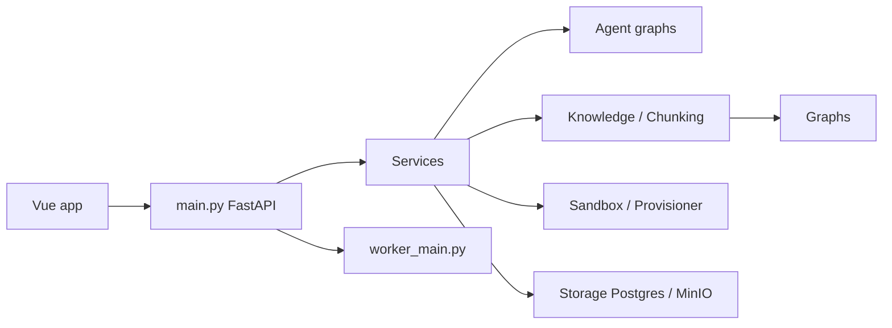

# xerrors/Yuxi

> Plateforme auto-hébergée multi-tenant d'agents LangGraph avec RAG et graphe de connaissances.

## Le problème
Une équipe qui veut des agents sur ses documents privés doit assembler RAG, graphe, outils, bac à sable et permissions à la main.

## Ce que ça fait vraiment
Backend FastAPI + front Vue ; agents LangGraph avec middlewares, sous-agents, Skills, MCP et outils.
Ingestion multi-formats (MinerU, PaddleOCR), chunking façon RAGFlow, retrieval Milvus/LightRAG/Dify, graphe Neo4j.
Bac à sable de fichiers pour produire des artefacts téléchargeables ; évaluation RAG et Langfuse.
Permissions par utilisateur/département, gestion centralisée des clés de modèles.

## Comment c'est branché


## Essayer
```bash
git clone --branch v0.7.3 --depth 1 https://github.com/xerrors/Yuxi.git
cd Yuxi
./scripts/init.sh
docker compose up --build -d
docker compose ps
curl --fail http://localhost:5050/api/system/ready
```

## Coût et pièges
Pile lourde (Milvus, Neo4j, Postgres, MinerU…) : machine costaude. Clé API de modèle (SiliconFlow par défaut).
Mises à jour entre versions nécessitant sauvegarde et migration.

## Ce que ce n'est pas
Pas une bibliothèque : un produit complet à déployer.
Documentation principalement en chinois ; licences des composants tiers à vérifier.

## Alternatives
- RAGFlow : référence du chunking utilisé.
- LightRAG : pour le seul graphe/RAG.
- DeerFlow : architecture d'agents en bac à sable.

## Pour toi
À surveiller : bonne vitrine d'une pile agents + RAG + graphe complète, utile comme référence d'architecture plus qu'à déployer.
