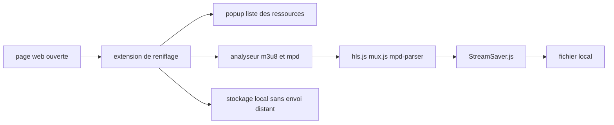

# xifangczy/cat-catch

> **Browser extension that lists the media resources loaded by the current page, so you can grab them.**

## The problem

A web page loads video or audio as segmented streams, and nothing in the browser tells you
which URLs actually went over the wire. Without a sniffing tool you are left opening the
devtools network tab and rebuilding an m3u8 or mpd manifest by hand, segment by segment.

## What it actually does

The README calls it a "resource sniffing extension" (资源嗅探扩展) that filters and lists the
resources of the current page. It offers a popup window showing what was detected and a
dedicated m3u8 parser — these are the only two interfaces the README documents, via
screenshots. The README states that everything collected is stored and processed locally, with
nothing sent to a remote server and no trackers included. It does not describe the supported
formats, the detection mechanism or the available options: that belongs to the external user
documentation at cat-catch.94cat.com. The credits reveal the underlying material: hls.js,
mux.js, mpd-parser, StreamSaver.js, MQTT.js and jQuery.

## How it is wired



No code-derived diagram exists for this repository, so the graph above is inferred from the
README alone. It connects only what the README names: detection on the page, the two
interfaces (popup and m3u8 parser), the libraries credited for stream parsing and writing to
disk, and the guarantee of local-only processing. The repository's real file names are not
documented in the README.

## Trying it

```bash
# Install from an extension store (Chrome, Edge, Firefox) using the README links, e.g.
# https://chromewebstore.google.com/detail/cat-catch/jfedfbgedapdagkghmgibemcoggfppbb

# Install from source, as described in the README:
# 1. git clone the repository
# 2. on the extensions page, enable "developer mode"
# 3. click "Load unpacked" and select the extension folder
```

The README provides no complete command line: the steps are written in prose. Nothing has been
reconstructed here. A third route is documented: download the crx file from the Releases page
(right click, save as) and drag it onto the extensions page.

## Cost and traps

Free, no API key, no account, no third-party service. The README flags three traps. First
compatibility: from version 1.0.17 onwards a Chromium engine of 93 or above is required, below
that you must stay on 1.0.16, and full functionality needs version 104 or above. Second, fake
clones: the README warns that because the project is open, copies with advertising code added
have been published to stores, and that only the install addresses on GitHub and in the user
documentation are authoritative. Third, licensing: 1.0 was MIT, 2.0 moved to GPL v3, with the
stated intent that derived extensions stay open — a copyleft that spreads to any reuse of the
code. The README also carries a legal disclaimer: the tool is meant only for content the user
owns or is authorised to download, and all legal responsibility rests with the user.

## What it is not

It is not a universal downloader in the yt-dlp sense: the extension sniffs what the current
page loads, it does not resolve a URL supplied outside the browser and cannot be scripted from
a command line. It is also not legally neutral: the project maintains an "avoid crawling list"
and invites sites to request exclusion through an `[Opt-Out Request]` issue, which means some
domains are or will be deliberately ignored. Finally it is not a reusable library: nothing in
the README exposes an API.

## Alternatives

The README names no competitor, only dependencies (hls.js, mux.js, mpd-parser,
StreamSaver.js), which are not alternatives. Among the neighbours supplied, only
alyssaxuu/screenity is adjacent — capturing media from the browser — but it records the screen
instead of recovering network streams, so it answers a different need. select2/select2 and
brookhong/Surfingkeys are off topic. In practice: no genuinely comparable alternative in the
catalogue.

## For you

Little direct value for a data / AI / MLOps profile: nothing to script, nothing to plug into a
pipeline, no API. The interest is marginal and occasional — grabbing a media stream seen in a
browser to build a dataset, where you have the right to do so. Worth knowing about rather than
adopting.
