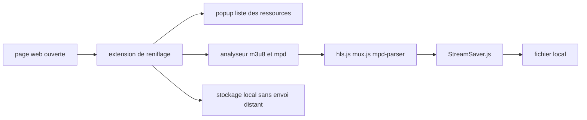

# xifangczy/cat-catch

> **Extension de navigateur qui liste les ressources média chargées par la page courante, pour les récupérer.**

## Le problème

Une page web charge des flux vidéo ou audio découpés en segments, et rien dans le navigateur
ne dit quelles URL ont réellement transité. Sans outil de reniflage, il faut ouvrir l'onglet
réseau des devtools et reconstituer à la main un manifeste m3u8 ou mpd, segment par segment.

## Ce que ça fait vraiment

Le README la décrit comme une « extension de reniflage de ressources » (资源嗅探扩展) qui
filtre et liste les ressources de la page en cours. Elle expose une fenêtre popup listant ce
qui a été détecté, et un analyseur m3u8 dédié — ce sont les deux seules interfaces que le
README documente, par capture d'écran. Le README indique que tout ce qui est collecté est
stocké et traité localement, sans envoi vers un serveur distant et sans tracker. Il ne détaille
ni les formats supportés, ni le mécanisme de détection, ni les options : cela relève de la
documentation utilisateur externe (cat-catch.94cat.com). Les remerciements laissent voir la
matière employée : hls.js, mux.js, mpd-parser, StreamSaver.js, MQTT.js, jQuery.

## Comment c'est branché



Aucun diagramme tiré du code n'existe pour ce dépôt : ce schéma est déduit du README seul. Il
relie ce que le README nomme explicitement — la détection sur la page, les deux interfaces
(popup et analyseur m3u8), les bibliothèques citées en remerciements pour le parsing de flux
et l'écriture sur disque, et la garantie de traitement local. Les noms de fichiers réels du
dépôt ne sont pas documentés dans le README.

## Essayer

```bash
# Installation par le magasin d'extensions (Chrome, Edge, Firefox) : voir les liens du README,
# par exemple https://chromewebstore.google.com/detail/cat-catch/jfedfbgedapdagkghmgibemcoggfppbb

# Installation depuis les sources, telle que décrite dans le README :
# 1. git clone du dépôt
# 2. page de gestion des extensions : activer le "mode développeur"
# 3. "Charger l'extension non empaquetée" et sélectionner le dossier de l'extension
```

Le README ne donne aucune ligne de commande complète : il décrit les étapes en langue
naturelle. Rien n'a été reconstruit ici. Une troisième voie est documentée : télécharger le
fichier crx depuis la page Releases (clic droit, enregistrer sous) puis le glisser dans la
page des extensions.

## Coût et pièges

Gratuit, sans clé d'API ni compte à créer, sans service tiers. Le README pose trois pièges
explicites. D'abord la compatibilité : à partir de la version 1.0.17, il faut un moteur
Chromium 93 ou plus, en dessous il faut rester en 1.0.16, et les fonctions complètes
demandent la version 104 ou plus. Ensuite les faux clones : le README avertit que, le projet
étant ouvert, des copies avec du code publicitaire ajouté circulent dans les magasins, et que
seules les adresses d'installation de GitHub et de la documentation utilisateur font foi.
Enfin la licence : 1.0 était en MIT, 2.0 est passé en GPL v3, avec l'intention affichée que
les extensions dérivées restent ouvertes — un copyleft qui contamine tout réemploi du code.
Le README porte aussi un avertissement légal : l'outil est réservé aux contenus dont
l'utilisateur détient les droits, la responsabilité juridique lui incombe entièrement.

## Ce que ce n'est pas

Ce n'est pas un téléchargeur universel de type yt-dlp : l'extension renifle ce que la page
courante charge, elle ne résout pas une URL fournie hors navigateur et ne s'automatise pas en
ligne de commande. Ce n'est pas non plus un outil neutre juridiquement : le dépôt maintient
une « liste d'évitement » et invite les sites à demander leur exclusion par une issue
`[Opt-Out Request]`, ce qui signifie que des domaines sont ou seront volontairement ignorés.
Enfin ce n'est pas une bibliothèque réutilisable : rien dans le README n'expose d'API.

## Alternatives

Le README ne nomme aucun concurrent, seulement des dépendances (hls.js, mux.js, mpd-parser,
StreamSaver.js) qui ne sont pas des alternatives. Parmi les voisins fournis, seul
alyssaxuu/screenity touche un domaine voisin — capturer du média depuis le navigateur — mais
il enregistre l'écran au lieu de récupérer les flux réseau, donc il répond à un autre besoin.
select2/select2 et brookhong/Surfingkeys sont hors sujet. En pratique : aucune alternative
réellement comparable dans le catalogue.

## Pour toi

Peu de valeur directe pour un profil data / IA / MLOps : rien à scripter, rien à intégrer dans
un pipeline, aucune API. L'intérêt est marginal et ponctuel — récupérer un flux média vu dans
un navigateur pour constituer un jeu de données, sous réserve d'en avoir le droit. À garder en
tête plutôt qu'à adopter.
