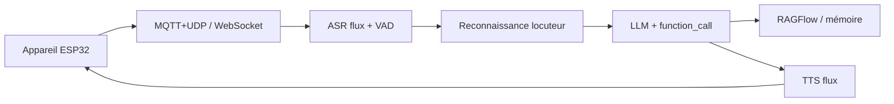

# xinnan-tech/xiaozhi-esp32-server

> Backend Python/Java/Vue pour assistants vocaux ESP32 parlant le protocole Xiaozhi.

## Le problème
Un boîtier ESP32 Xiaozhi dépend du backend hébergé par son auteur ; sans serveur propre, aucune
maîtrise des modèles, des données vocales ni des clés d'API utilisées.

## Ce que ça fait vraiment
Expose MQTT+UDP, WebSocket et HTTP, avec ASR et TTS en flux, VAD, reconnaissance de locuteur en
parallèle de l'ASR, identification d'intention par appel de fonction, mémoire courte locale ou mem0/PowerMem,
et base de connaissances RAGFlow. Deux installations : minimale (fichier de config) ou complète
(base de données, console web multi-utilisateurs, multi-agents, envoi de commandes MCP aux appareils).

## Comment c'est branché


## Essayer
```bash
python start.py
python performance_tester.py
```

## Coût et pièges
Configuration « tout gratuit » possible (FunASR local, glm-4-flash, EdgeTTS) mais il faut 2 cœurs/4 Go,
4 cœurs/8 Go en installation complète. La configuration « flux » repose sur des API payantes chinoises
(Xunfei, Huoshan, Bailian) : comptes et clés à votre charge.

## Ce que ce n'est pas
Le README **avertit explicitement** : fonctionnalités incomplètes, aucun audit de sécurité réseau,
à ne pas utiliser en production. Aucun lien commercial avec les fournisseurs d'API, aucune garantie
sur les fonds déposés chez eux. Matériel ESP32 obligatoire. Licence non déclarée.

## Alternatives
- **百聆 (Bailing)** : robot de dialogue vocal dont ce projet s'inspire et sur lequel il est bâti.

## Pour toi
Hors sujet pour un profil data/MLOps, sauf curiosité domotique ; le README déconseille la prod.
