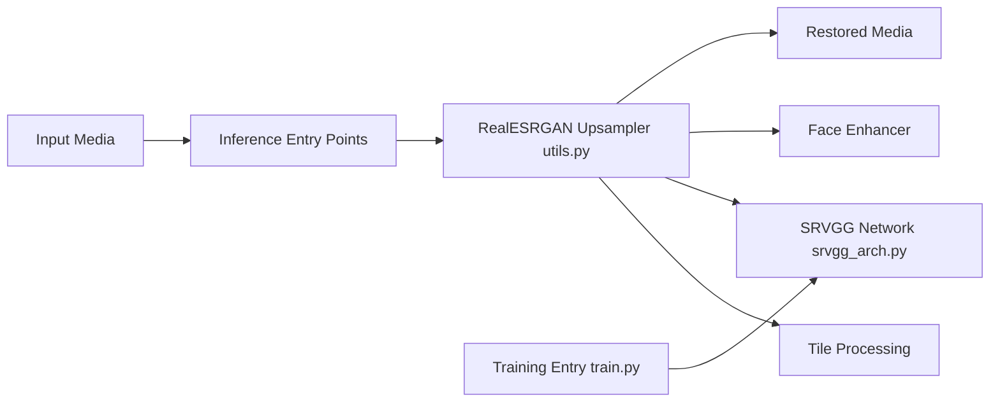

# xinntao/Real-ESRGAN

> Modèles et scripts de super-résolution d'images et vidéos réelles, pour chercheurs et praticiens vision.

## Le problème
Agrandir une image dégradée (compression, flou, bruit) produit des artefacts avec les méthodes classiques.

## Ce que ça fait vraiment
Réseaux entraînés sur des dégradations synthétiques (article ICCVW 2021, Tencent ARC) pour upscaler x2 à x4.
Inférence image ou vidéo, par tuiles ou image entière, avec amélioration de visages optionnelle via GFPGAN.
Modèles généraux et anime ; exécutables NCNN-Vulkan portables sans CUDA ni PyTorch.
Entraînement via BasicSR sur jeux synthétiques ou appariés.

## Comment c'est branché


## Essayer
```bash
git clone https://github.com/xinntao/Real-ESRGAN.git
cd Real-ESRGAN
pip install basicsr
pip install facexlib
pip install gfpgan
pip install -r requirements.txt
python setup.py develop
wget https://github.com/xinntao/Real-ESRGAN/releases/download/v0.1.0/RealESRGAN_x4plus.pth -P weights
python inference_realesrgan.py -n RealESRGAN_x4plus -i inputs --face_enhance
```

## Coût et pièges
GPU recommandé pour le script Python ; l'exécutable NCNN peut créer des incohérences entre tuiles. Dernier push en août 2024, 647 issues ouvertes.

## Ce que ce n'est pas
Pas une restauration fidèle : le modèle invente du détail. Pas une librairie maintenue activement ; l'exécutable ne gère pas toutes les options (`outscale`).

## Alternatives
- Real-ESRGAN-ncnn-vulkan : binaire portable sans environnement Python.
- Upscayl : interface graphique bâtie sur ce modèle.
- Waifu2x-Extension-GUI : GUI multi-moteurs pour l'anime.

## Pour toi
Brique d'upscaling fiable à intégrer dans un pipeline image ; figée, mais toujours une référence.
