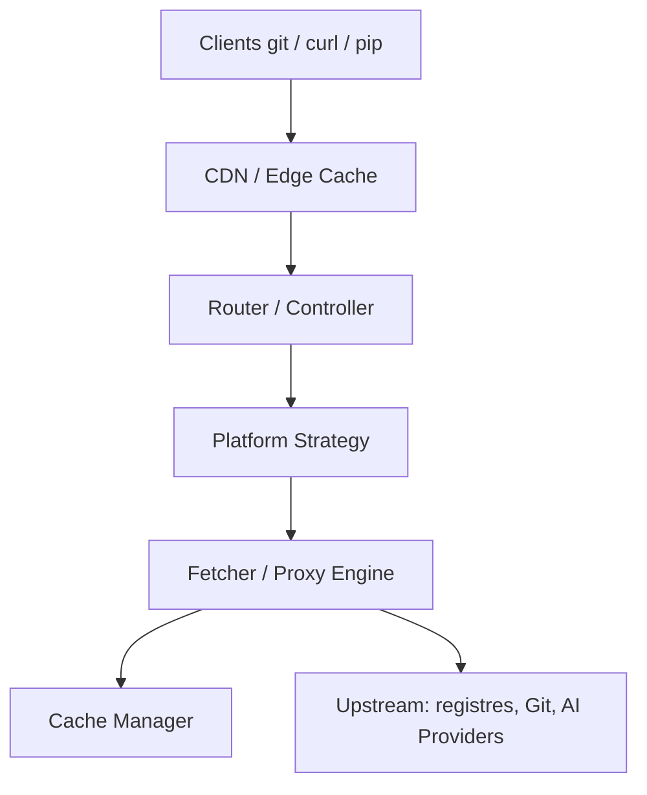

# xixu-me/Xget

> Proxy d'accélération pour dépôts Git, registres de paquets, modèles, conteneurs et API d'IA, déployable sur Cloudflare Workers.

## Le problème
Les téléchargements de code, paquets, modèles et images de conteneurs sont lents ou bloqués depuis certaines régions.

## Ce que ça fait vraiment
Un Worker reconnaît un préfixe de plateforme (`gh`, `hf`, `pypi`, `npm`, `cr/ghcr`, `ip/openai`…), réécrit l'URL, interroge l'amont avec retries (3 max) et délai de 30 s, met en cache les réponses compatibles (pas les opérations Git) et ajoute des en-têtes de sécurité et `X-Performance-Metrics`. Il couvre aussi Hugging Face (`HF_ENDPOINT`), Civitai et les API OpenAI, Anthropic et Gemini.

## Comment c'est branché


## Essayer
```bash
git clone https://xget.xi-xu.me/gh/microsoft/vscode.git
pip install requests -i https://xget.xi-xu.me/pypi/simple/
docker run -d --name xget -p 8080:8080 ghcr.io/xixu-me/xget:latest
```

## Coût et pièges
Le Worker demande un compte Cloudflare (ou Vercel, Netlify, EdgeOne) et des secrets GitHub ; l'auto-hébergement Docker perd l'accélération en périphérie. L'instance publique est « pour essai uniquement ». Des clés d'API passeraient par un intermédiaire : à protéger par authentification ou liste d'IP.

## Ce que ce n'est pas
Pas un miroir fiable pour la production si tu t'appuies sur l'instance publique. Le catalogue ne déclare pas de licence, alors que le README annonce AGPL-3.0 (copyleft réseau) : à vérifier avant tout usage.

## Alternatives
Aucune alternative nommée dans le README.

## Pour toi
À surveiller : utile pour accélérer HF, PyPI, conda et conteneurs depuis un réseau lent, mais auto-hébergé derrière authentification, jamais l'instance publique avec des clés d'API.

