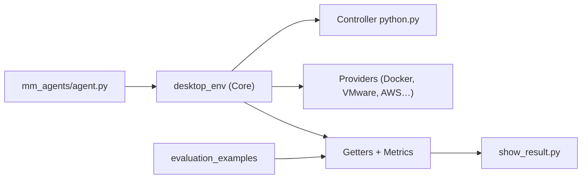

# xlang-ai/OSWorld

> Banc d'essai d'agents multimodaux sur de vrais bureaux virtualisés (Ubuntu, Windows).

## Le problème
Mesurer si un agent sait accomplir des tâches réelles (LibreOffice, Chrome, Thunderbird) demande un environnement reproductible et des évaluateurs automatiques.

## Ce que ça fait vraiment
`DesktopEnv` démarre une VM via un fournisseur (VMware, VirtualBox, Docker, AWS, Modal, Daytona) ; un agent envoie des actions (pyautogui) ; des « getters » et « metrics » comparent l'état final à l'attendu, sur des exemples JSON par application. Un agent de référence GPT-4o en captures d'écran est fourni. Résultats agrégés par domaine avec `show_result.py`. Une évaluation publique passe par une réunion avec les mainteneurs.

## Comment c'est branché


## Essayer
```bash
git clone https://github.com/xlang-ai/OSWorld
cd OSWorld
pip install -r requirements.txt
python quickstart.py --provider_name vmware --path_to_vm "path/to/your/vm.vmx"
python scripts/python/run_multienv.py --provider_name docker --headless --observation_type screenshot --model gpt-4o --num_envs 10 --client_password password
```

## Coût et pièges
VM lourdes (hyperviseur ou Docker, ou cloud facturé). Clé OpenAI pour l'agent de base. Certaines tâches exigent un compte Google (OAuth) et un proxy ; sans cela les scores baissent. Nettoyer les conteneurs résiduels après interruption.

## Ce que ce n'est pas
Pas un agent : c'est un banc de mesure. Un score local n'est pas sur le classement vérifié tant que les mainteneurs ne l'ont pas rejoué.

## Alternatives
`OSWorld-MCP` (même équipe, évalue l'usage d'outils MCP), cité dans le README.

## Pour toi
Surveiller : référence pour évaluer des agents « computer use », mais coûteux à monter ; à ressortir si tu compares des agents.
