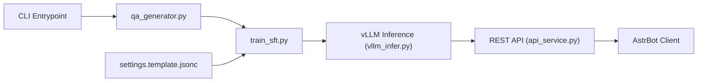

# xming521/WeClone

> Chaîne complète pour fine-tuner un LLM sur ton historique de chat et le déployer en bot.

## Le problème
Créer un « double numérique » qui écrit comme toi suppose d'exporter, nettoyer et anonymiser des conversations, puis de fine-tuner et servir un modèle.

## Ce que ça fait vraiment
`make-dataset` transforme un export Telegram JSON en paires question-réponse, avec filtrage de données personnelles par Microsoft Presidio et liste de mots bloqués.
`train-sft` fine-tune Qwen2.5-VL-7B-Instruct en LoRA via LLaMA Factory ; DeepSpeed pour le multi-GPU.
`server` expose une API compatible OpenAI ; `webchat-demo` pour tester.
Branchement sur AstrBot ou LangBot pour Discord, Telegram, Slack.

## Comment c'est branché


## Essayer
```bash
git clone https://github.com/xming521/WeClone.git && cd WeClone
uv venv .venv --python=3.12
uv pip install --group main -e .
cp examples/tg.template.jsonc settings.jsonc
weclone-cli make-dataset
weclone-cli train-sft
weclone-cli server
```

## Coût et pièges
GPU requis : environ 16 Go de VRAM en LoRA pour un 7B, CUDA 12.6+. Le README affiche un sponsor d'API tiers, non nécessaire au fonctionnement.

## Ce que ce n'est pas
Pas un outil de production : le README le dit lui-même. Presidio ne garantit pas une anonymisation complète. Les appels d'outils ne fonctionnent plus après fine-tuning. AGPL-3.0.

## Alternatives
- LLaMA-Factory : le moteur de fine-tuning utilisé, à prendre directement pour d'autres données.
- AstrBot / LangBot : seulement pour la partie bot.

## Pour toi
À surveiller comme exemple de bout en bout (données → LoRA → API OpenAI-compatible), mais les questions de consentement et de vie privée limitent l'intérêt au-delà de l'expérimentation.
