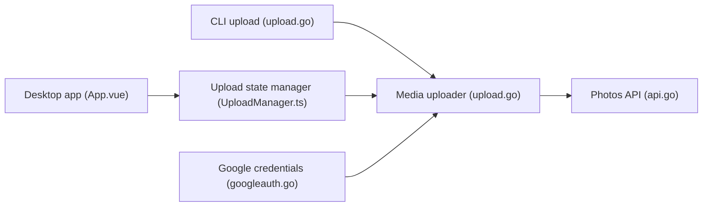

# xob0t/gotohp

> Client de bureau non officiel pour téléverser des photos vers Google Photos, avec mode CLI.

## Le problème
L'envoi en masse de photos vers Google Photos depuis un ordinateur est limité par les outils officiels.

## Ce que ça fait vraiment
Interface de glisser-déposer et CLI : envoi de fichiers ou dossiers (récursif), nombre de fils réglable, progression en temps réel, fichiers déjà présents ignorés, gestion de plusieurs comptes. Utilise des identifiants obtenus par la page Embedded Setup de Google (cookie `oauth_token`), un APK ReVanced ou un appareil rooté. La GUI repose sur Wails ; la CLI partage le fichier de configuration.

## Comment c'est branché


## Essayer
```bash
gotohp-cli upload /path/to/photos --recursive --threads 5
gotohp-cli creds add "<oauth_token cookie value>"
gotohp-cli creds set user@gmail.com
```

## Coût et pièges
Gratuit, mais l'obtention des identifiants est manuelle (outils de développement du navigateur, ADB, interception réseau). Rien ne garantit que Google laisse le client fonctionner ; le risque sur le compte n'est pas documenté.

## Ce que ce n'est pas
Pas un client officiel Google. Le README ne détaille pas ce que « envois illimités » implique côté quota.

## Alternatives
Aucune alternative nommée dans le README.

## Pour toi
À ignorer : un contournement fragile d'un service propriétaire, sans usage évident pour tes pipelines de données.

