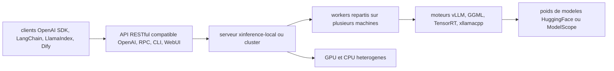

# xorbitsai/inference

> **A self-hosted, multi-modality inference server exposing an OpenAI-compatible API.**

## The problem

Serving a language model, a speech recognition model, an embedding model and an image model
yourself usually means four separate stacks, four weight formats and four bespoke APIs. On
top of that sits the engine choice — vLLM, llama.cpp, GGML, TensorRT — which is driven
differently depending on the hardware you actually have.

## What it actually does

Xinference runs a server that loads built-in and custom models, then exposes them behind an
OpenAI-compatible RESTful API (Function Calling included), plus RPC, a CLI and a web UI. It
covers language, audio, image, embedding, rerank and multimodal models, where the README's
own comparison table restricts FastChat, OpenLLM and RayLLM to a subset. Compute is handed
to third-party engines (vLLM, GGML via ggml, TensorRT, and xllamacpp, which the Xinference
team maintains), and a model can be spread across several workers for multi-node
deployment. The README also claims automatic batching of concurrent requests and a KV cache
shared across vLLM replicas. Reading note: the README leans heavily on superlatives
("powerful", "seamless", "state-of-the-art"); the factual substance is in the comparison
table and the install commands.

## How it is wired



The README describes this path: a client talks to the OpenAI-compatible API, the server
started by `xinference-local` or by the Helm chart routes to workers, and each worker runs
the model on whichever engine suits the available hardware. Built-in model weights point to
HuggingFace and ModelScope. The internal file layout is not documented in the README, and
no code-derived diagram ships with this repository.

## Trying it

```bash
pip install "xinference[all]"
xinference-local
```

```bash
docker run --name xinference -d -p 9997:9997 -e XINFERENCE_HOME=/data -v </on/your/host>:/data --gpus all xprobe/xinference:latest xinference-local -H 0.0.0.0
```

```
# add repo
helm repo add xinference https://xorbitsai.github.io/xinference-helm-charts

# update indexes and query xinference versions
helm repo update xinference
helm search repo xinference/xinference --devel --versions

# install xinference
helm install xinference xinference/xinference -n xinference --version 0.0.1-v<xinference_release_version>
```

## Cost and traps

The code is Apache-2.0 and the community edition is free, but the README explicitly points
to a "Xinference Enterprise" with extra features and a sales contact by email: the model is
freemium and some enterprise pieces are not in the repository. Hardware-wise, the Docker
image and the Helm chart assume NVIDIA GPUs with CUDA installed, and the Kubernetes route
requires a GPU-enabled cluster. `pip install "xinference[all]"` pulls the whole engine stack
at once, which is heavy. Weights are not bundled: every built-in model is downloaded from
HuggingFace or ModelScope, so a third-party service and a lot of disk. The README documents
neither memory footprint, nor minimum VRAM, nor telemetry. Version 3.0.0 is flagged with
breaking changes and migration notes.

## What it is not

It is not an inference engine: the compute is done by vLLM, GGML, TensorRT or xllamacpp,
and Xinference is the serving and orchestration layer above them. It is not a model provider
either, nor a RAG or agent platform: Dify, FastGPT, RAGFlow, MaxKB and Xagent are
integrations, not components of the repo. And it is not a managed service — unless you take
the enterprise offer, everything runs on your own hardware, with the operational burden that
implies.

## Alternatives

The README compares head-on with **FastChat**, **OpenLLM** and **RayLLM**: all three serve
LLMs behind an OpenAI-compatible API, while Xinference also covers image, embedding, audio
and multimodal models plus multi-node deployment. Among the catalogue neighbours,
**huggingface/transformers** is the library you use to load a model inside your own code,
not to serve it; **modelscope/FunASR** only covers speech recognition. Pick Xinference for
one server across all modalities, a dedicated tool otherwise.

## For you

For a data / AI / MLOps profile who has to provide internal inference endpoints without
depending on a paid API, this is the right brick: a single OpenAI-compatible API in front of
a heterogeneous model fleet, with a documented Kubernetes path. Keep in mind that the value
is the orchestration, not raw engine performance.
