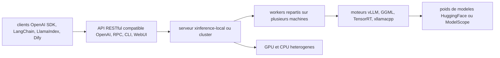

# xorbitsai/inference

> **Serveur d'inférence local multi-modalités, exposé en API compatible OpenAI, pour équipes qui auto-hébergent.**

## Le problème

Servir soi-même un LLM, un modèle de reconnaissance vocale, un modèle d'embedding et un
modèle d'image veut normalement dire quatre piles différentes, quatre formats de poids et
quatre API maison. À cela s'ajoute le choix du moteur — vLLM, llama.cpp, GGML, TensorRT —
qui ne se pilote pas de la même façon selon la machine disponible.

## Ce que ça fait vraiment

Xinference lance un serveur qui charge des modèles « built-in » et des modèles personnalisés,
puis les expose derrière une API RESTful compatible OpenAI (Function Calling inclus), plus
RPC, CLI et interface web. Il couvre les modèles de langage, audio, image, embedding,
rerank et multimodaux, là où le tableau comparatif du README limite FastChat, OpenLLM et
RayLLM à un sous-ensemble. Il délègue le calcul à des moteurs tiers (vLLM, GGML via ggml,
TensorRT, xllamacpp — ce dernier maintenu par l'équipe) et sait répartir un modèle sur
plusieurs workers pour du déploiement multi-nœuds. Le README annonce aussi un batching
automatique des requêtes concurrentes et un cache KV partagé entre réplicas vLLM.
Note de lecture : le README est très chargé en superlatifs (« powerful », « seamless »,
« state-of-the-art », « cutting-edge ») ; la matière factuelle est surtout dans le tableau
comparatif et les commandes d'installation.

## Comment c'est branché



Le README décrit le chemin suivant : un client parle à l'API compatible OpenAI, le serveur
lancé par `xinference-local` ou par le chart Helm route vers des workers, qui exécutent le
modèle sur le moteur adapté au matériel disponible. Les poids des modèles intégrés pointent
vers HuggingFace et ModelScope. Le découpage interne en fichiers n'est pas documenté dans le
README, et aucun diagramme tiré du code n'accompagne ce dépôt.

## Essayer

```bash
pip install "xinference[all]"
xinference-local
```

```bash
docker run --name xinference -d -p 9997:9997 -e XINFERENCE_HOME=/data -v </on/your/host>:/data --gpus all xprobe/xinference:latest xinference-local -H 0.0.0.0
```

```
# add repo
helm repo add xinference https://xorbitsai.github.io/xinference-helm-charts

# update indexes and query xinference versions
helm repo update xinference
helm search repo xinference/xinference --devel --versions

# install xinference
helm install xinference xinference/xinference -n xinference --version 0.0.1-v<xinference_release_version>
```

## Coût et pièges

Le code est sous Apache-2.0 et l'édition communautaire est gratuite, mais le README renvoie
explicitement à une « Xinference Enterprise » à fonctionnalités supplémentaires, contact
commercial par e-mail : le modèle est donc freemium et certaines briques d'entreprise ne
sont pas dans le dépôt. Côté machine, l'image Docker et le chart Helm supposent des GPU
NVIDIA avec CUDA installé ; la voie Kubernetes exige un cluster avec support GPU. Le
`pip install "xinference[all]"` tire toute la pile de moteurs d'un coup, ce qui est lourd.
Enfin les poids ne sont pas fournis : chaque modèle intégré se télécharge depuis
HuggingFace ou ModelScope, donc un service tiers et beaucoup de disque. Le README ne
documente ni empreinte mémoire, ni VRAM minimale, ni télémétrie. La version 3.0.0 est
signalée avec des « breaking changes » et des notes de migration.

## Ce que ce n'est pas

Ce n'est pas un moteur d'inférence : le calcul est fait par vLLM, GGML, TensorRT ou
xllamacpp, Xinference est la couche de service et d'orchestration au-dessus. Ce n'est pas
non plus un fournisseur de modèles ni une plateforme RAG ou agent : Dify, FastGPT, RAGFlow,
MaxKB et Xagent sont des intégrations, pas des composants du dépôt. Et ce n'est pas un
service managé — sauf à passer par l'offre entreprise, tout tourne sur ton matériel, avec
la maintenance qui va avec.

## Alternatives

Le README compare frontalement à **FastChat**, **OpenLLM** et **RayLLM** : ces trois-là
servent des LLM en API compatible OpenAI, Xinference se distingue en couvrant aussi image,
embedding, audio et multimodal, et le multi-nœuds. Parmi les voisins du catalogue,
**huggingface/transformers** est la bibliothèque qu'on utilise pour charger un modèle dans
son propre code, pas pour le servir ; **modelscope/FunASR** ne couvre que la reconnaissance
vocale. Prendre Xinference si l'on veut un seul serveur pour toutes les modalités, une
brique dédiée sinon.

## Pour toi

Pour un profil data / IA / MLOps qui doit fournir des endpoints d'inférence internes sans
dépendre d'une API payante, c'est exactement la brique : une seule API compatible OpenAI
devant un parc de modèles hétérogène, avec un chemin Kubernetes documenté. À garder en tête
que la valeur ajoutée est l'orchestration, pas la performance brute du moteur.
