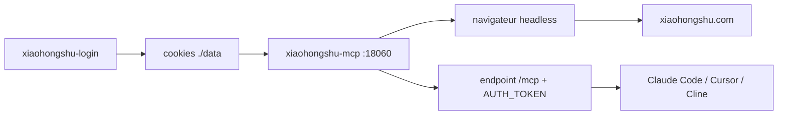

# xpzouying/xiaohongshu-mcp

> Serveur MCP qui donne à un agent l'accès au compte Xiaohongshu d'un utilisateur.

## Le problème
Publier et surveiller un compte Xiaohongshu depuis un agent suppose de piloter
soi-même un navigateur, la session et les jetons `xsec_token`.

## Ce que ça fait vraiment
Expose treize outils MCP : `check_login_status`, `get_login_qrcode`,
`delete_cookies`, `publish_content` (titre, contenu, images locales ou HTTP, tags,
publication programmée ISO8601, mention d'originalité, visibilité, produits),
`publish_with_video`, `list_feeds`, `search_feeds` avec filtres de tri, type de note,
date, périmètre et distance, `get_feed_detail` avec commentaires et données
d'interaction, `post_comment_to_feed`, `reply_comment_in_feed`, `like_feed`,
`favorite_feed`, `user_profile`. Sert en HTTP sur `:18060/mcp` ; un outil de login
séparé enregistre la session.

## Comment c'est branché


## Essayer
```bash
./xiaohongshu-login-darwin-arm64
./xiaohongshu-mcp-darwin-arm64
docker pull xpzouying/xiaohongshu-mcp
claude mcp add --transport http xiaohongshu-mcp http://localhost:18060/mcp
AUTH_TOKEN=your-secret-token ./xiaohongshu-mcp-darwin-arm64
```

## Coût et pièges
Apache 2.0, gratuit. Premier lancement : téléchargement d'un navigateur headless
d'environ 150 Mo. L'authentification est désactivée par défaut — `AUTH_TOKEN` est
recommandé en production, et un jeton passé en argument de ligne de commande est
visible dans la liste des processus. Un même compte ne peut pas être connecté sur
plusieurs sessions web : se reconnecter ailleurs éjecte le MCP.

## Ce que ce n'est pas
Pas une API officielle : c'est du pilotage de navigateur sur une plateforme qui ne
l'a pas prévu. L'auteur rapporte un an d'usage sans blocage de compte, mais c'est un
témoignage, pas une garantie ; les comptes non certifiés déclenchent une demande de
vérification d'identité. macOS Intel et Linux ARM64 ne sont pas supportés. Le README
avertit lui-même que le passage par OpenClaw/MCPorter n'est pas maintenu ici.

## Alternatives
- xpzouying/x-mcp : version extension navigateur, sans Docker ni déploiement.
- xiaohongshu-skills : variante skills prête à l'emploi.

## Pour toi
Sans compte Xiaohongshu, aucun usage. Ignorer.
