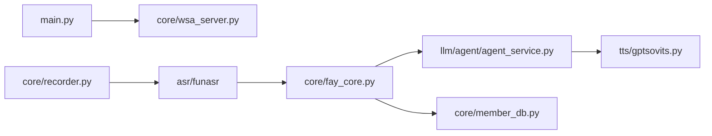

# xszyou/Fay

> Framework chinois d'humain numérique reliant ASR, LLM, TTS et avatars pour terminaux variés.

## Le problème
Brancher un avatar parlant sur un LLM, une reconnaissance et une synthèse vocales interchangeables, pour app, web ou microcontrôleur.

## Ce que ça fait vraiment
Serveur Python avec interfaces texte, voix, pilotage d'avatar, diffusion automatique, intentions.
LLM compatibles OpenAI, ASR (FunASR, Ali…), TTS (GPT-SoVITS, Azure, Volcano…) interchangeables.
Agent avec appels d'outils, gestion MCP, base de connaissances et QA personnalisés (`qa.csv`), multi-utilisateurs.
Page d'admin sur `127.0.0.1:5000`.

## Comment c'est branché


## Essayer
```bash
pip install -r requirements.txt
python main.py start -config_center d19f7b0a-2b8a-4503-8c0d-1a587b90eb69
```

## Coût et pièges
Gratuit ; la clé de config publique est lente, il faut la tienne. Python 3.12, portaudio sous Ubuntu.

## Ce que ce n'est pas
Pas documenté en anglais : doc sur Feishu en chinois. Le « commercial sans responsabilité » du README contraste avec la GPL.

## Alternatives
Aucune alternative nommée ; openclaw, OpenAI Codex et FunASR sont cités comme références.

## Pour toi
À ignorer hors projet d'avatar vocal en contexte chinois : doc et écosystème peu accessibles.
