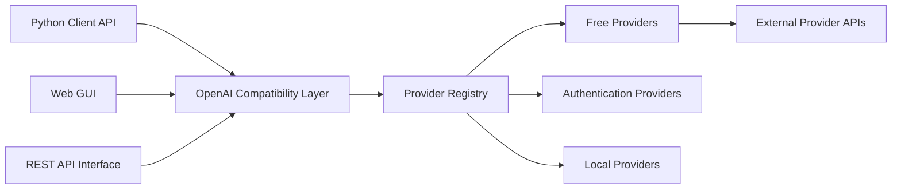

# xtekky/gpt4free

> Agrégateur communautaire de fournisseurs LLM tiers derrière une API compatible OpenAI, une GUI et des clients.

## Le problème
Vouloir appeler plusieurs LLM et générateurs d'images par une interface unique, sans gérer une clé par fournisseur.

## Ce que ça fait vraiment
Un client Python (synchrone et asynchrone), une GUI web, une API FastAPI compatible OpenAI (« Interference API »), un client JavaScript et un serveur MCP (recherche web, scraping, images).
Tout passe par un registre de fournisseurs : gratuits, à authentification (cookies et fichiers HAR montés dans `har_and_cookies`), locaux, dépréciés. Certains fournisseurs pilotent Chrome ; un bureau VNC (port 7900) sert aux connexions manuelles.
L'analyse d'architecture fournie est générique : peu de fichiers réels cités.

## Comment c'est branché


## Essayer
```bash
docker pull hlohaus789/g4f
pip install -U g4f[all]
python -m g4f.cli gui --port 8080 --debug
python -m g4f --port 8080 --debug
g4f mcp
```

## Coût et pièges
Gratuit, GPL-3.0 ; Chrome/Chromium pour certains fournisseurs ; `--shm-size` à augmenter pour l'automatisation de navigateur. Tout dépend de services tiers hors de ton contrôle.

## Ce que ce n'est pas
Pas une API officielle : un agrégateur de fournisseurs « accessibles », dont la disponibilité n'est pas garantie. Le README contient une politique de retrait (takedown) : un signal sur le statut juridique de certains accès.

## Alternatives
Aucune alternative nommée dans le README.

## Pour toi
À ignorer pour tout travail sérieux : base fragile, statut des accès flou.
