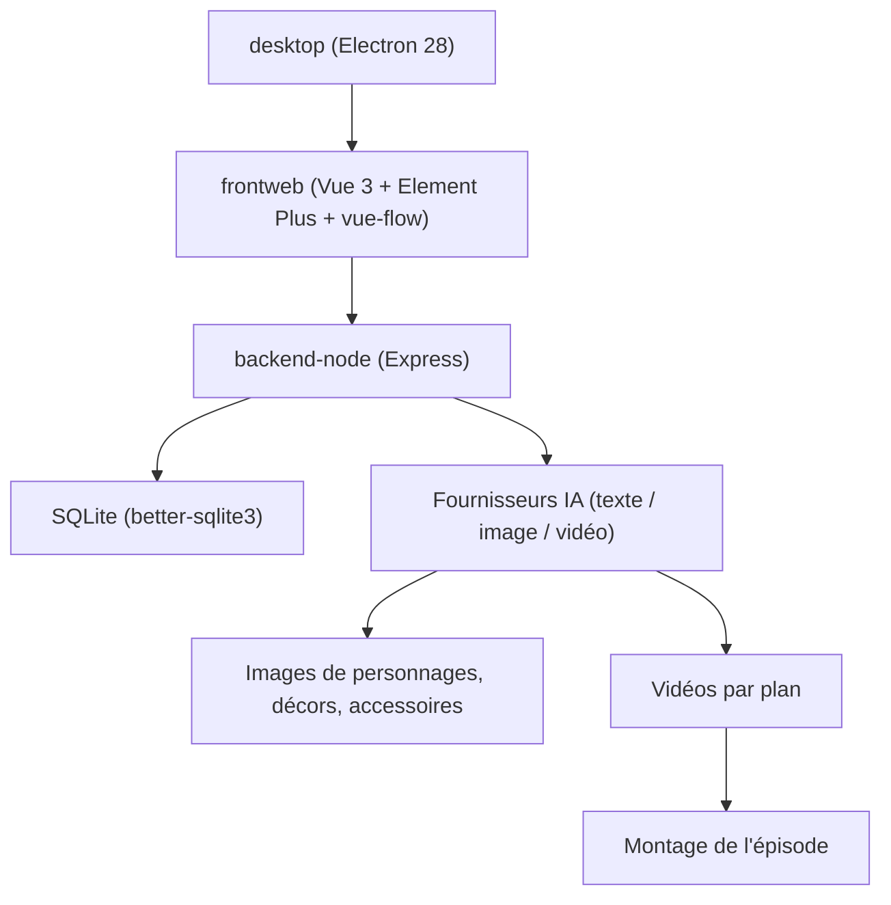

# xuanyustudio/LocalMiniDrama

> Outil local de création de courts métrages IA : scénario, personnages, storyboard, montage.

## Le problème
Les outils de court métrage IA sont des SaaS par abonnement, et tes rushes comme tes scénarios
partent sur leurs serveurs.

## Ce que ça fait vraiment
Chaîne complète en huit étapes : génération d'histoire à partir d'un synopsis et d'un style,
édition du scénario par épisode, extraction et génération des images de personnages,
extraction des décors, génération des accessoires, storyboard par épisode (avec échelle de
plan, mouvement de caméra, dialogues), génération image puis vidéo plan par plan, et montage
final en un fichier d'épisode. Deux vues sur les mêmes données : une liste pour l'édition fine
et un canevas façon pipeline visuel (`/film/:id/canvas`) où l'on édite dans les nœuds, crée
par menu contextuel et relance un groupe entier de plans. Un mode « une touche » enchaîne tout
en sautant ce qui existe déjà, avec jusqu'à trois reprises par étape en cas de limitation.

## Comment c'est branché


## Essayer
```bash
git clone https://github.com/xuanyustudio/LocalMiniDrama.git
cd LocalMiniDrama
cd backend-node && npm install
cp configs/config.example.yaml configs/config.yaml   # 填入 API Key
npm run migrate && npm start
cd frontweb && npm install && npm run dev
```

## Coût et pièges
Le logiciel est gratuit et sans abonnement, mais chaque image et chaque plan vidéo passe par
l'API d'un fournisseur payant : DashScope, Volcengine/Seedance, Kling, Agnes AI, Gemini
(Imagen/Veo), Vidu, NanoBanana, ou un endpoint compatible OpenAI. Le README est en chinois.
Les binaires livrés sont des `.exe` Windows ; le développement demande Node ≥ 18. La
configuration vit dans `%APPDATA%\LocalMiniDrama\backend\configs\config.yaml`.

## Ce que ce n'est pas
« Local » signifie que les données et les fichiers restent chez toi (SQLite + fichiers), pas
que la génération tourne en local : les modèles d'image et de vidéo sont distants. Ce n'est
pas non plus un éditeur vidéo : le montage est un assemblage automatique des plans.

## Alternatives
- Ollama et tout endpoint compatible OpenAI, utilisables pour la partie texte seulement.

## Pour toi
Hors périmètre data/MLOps ; à regarder uniquement par curiosité sur l'orchestration multi-modèle.
