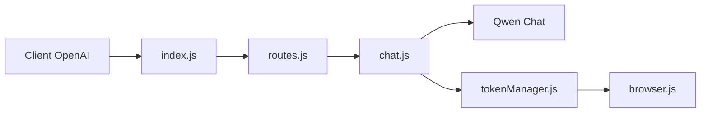

# y13sint/FreeQwenApi

> Proxy local compatible OpenAI qui exploite un compte web Qwen Chat via un navigateur automatisé.

## Le problème
Utiliser les modèles Qwen dans des outils compatibles OpenAI sans clé d'API officielle.

## Ce que ça fait vraiment
Un serveur Express écoute sur `localhost:3264/api` : complétions de chat (avec outils émulés par prompt), génération d'images et de vidéos, upload de fichiers, liste de modèles. Il pilote Chromium pour s'authentifier à Qwen Chat, stocke les jetons dans `session/` et alterne entre comptes en cas de limite. README en russe, marqué d'un filigrane t.me/forgetmeai.

## Comment c'est branché


## Essayer
```bash
git clone https://github.com/ForgetMeAI/FreeQwenApi
cd FreeQwenApi
npm install
npm run auth
SKIP_ACCOUNT_MENU=true npm start
```

## Coût et pièges
Gratuit mais un compte Qwen Chat est requis ; les jetons expirent, les limites de compte s'appliquent. Les secrets de `session/` ne doivent pas être commités.

## Ce que ce n'est pas
Ni modèle local ni API officielle d'Alibaba : proxy non officiel, fragile si Qwen change son API, et probablement contraire aux conditions d'usage (non vérifié). Aucune licence.

## Alternatives
Aucune alternative citée dans le README.

## Pour toi
À ignorer en production : fragile, sans licence et contournant l'API officielle ; passe par l'API Qwen payante.

