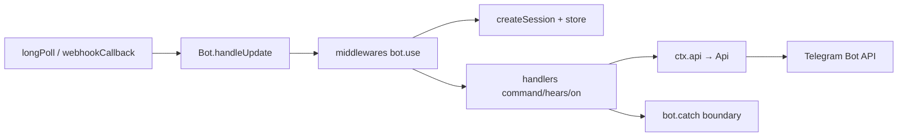

# yagop/node-telegram-bot-api

> Bibliothèque TypeScript pour bots Telegram, v2 réécrite, portable des serveurs au serverless.

## Le problème
Un bot Telegram écrit pour Node ne tourne pas tel quel sur Cloudflare Workers ou Vercel, et l'état d'une conversation disparaît au redémarrage.

## Ce que ça fait vraiment
Expose `Api`, qui reflète l'API Telegram méthode pour méthode, et `Bot`, avec middlewares koa-style où `on`, `command` et `hears` sont des filtres de la même chaîne.
Webhook web-standard `(Request) => Promise`, plus des adaptateurs Next.js, Express et serveur Node.
Sessions opt-in avec store obligatoire (mémoire, fichier, SQLite, SQL, Redis) : rien ne vit en mémoire de processus entre deux updates.
Suivi des réponses et des appuis de boutons stocké comme donnée, pas comme promesse, donc il survit à un redémarrage.

## Comment c'est branché


## Essayer
```sh
npm install node-telegram-bot-api
DEBUG="node-telegram-bot-api:*" node app.js
bun run check
bun run build
```

## Coût et pièges
Gratuit ; il faut un `BOT_TOKEN` obtenu auprès de Telegram. Le `secret_token` du webhook est la seule chose qui authentifie l'appelant — les payloads ne sont pas signés. Les stores `/bun` importent des built-ins Bun et ne résolvent pas sous Node ou edge.

## Ce que ce n'est pas
Pas compatible v1 : la v2 est une réécriture complète, avec un guide de migration dans le changelog. Les tables de suivi de réponses ne s'expirent pas toutes seules, il faut un TTL ou un `replyTracking` plafonné. Le tracing `debug` est Node-only, inerte sur edge.

## Alternatives
Aucune bibliothèque concurrente nommée dans le README.

## Pour toi
Hors périmètre data pur, mais une bonne référence de conception : stores explicites, état sérialisé, portabilité serverless.
