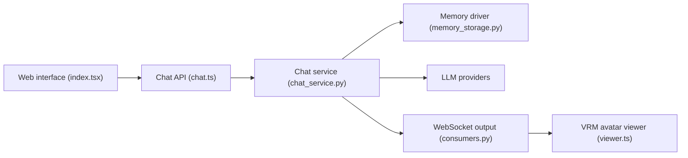

# yakami129/VirtualWife

> Chatbot de personnage virtuel avec avatar VRM, mémoire et voix, déployable par Docker.

## Le problème
Discuter avec un personnage animé qui garde une personnalité et une mémoire, sans assembler soi-même LLM, voix et avatar.

## Ce que ça fait vraiment
Un backend Django et un client web affichent un modèle VRM. Tu choisis un rôle et un LLM (OpenAI ou Ollama), les réponses sont streamées et pilotent voix et expressions. La mémoire longue peut passer par un stockage local, Milvus ou Zep. Un client de live Bilibili est aussi présent. Le README se dit « en incubation ».

## Comment c'est branché

Le lien front-back n'est pas vérifié dans l'architecture fournie.

## Essayer
```bash
cd installer
mv env_example .env
cd linux
sh start.sh
# puis http://localhost/
```

## Coût et pièges
Clé OPENAI_API_KEY (ou Ollama local). Derrière Docker, l'accès à Ollama passe par `http://host.docker.internal:11434`. Premier démarrage : environ 5 minutes d'images à télécharger.

## Ce que ce n'est pas
Pas un framework d'agents. Documentation en chinois. Dernier push en octobre 2024 : aucune garantie de suite.

## Alternatives
Aucune alternative nommée dans le README.

## Pour toi
À ignorer pour un profil data/MLOps : projet de compagnon virtuel orienté grand public, porté par une seule personne et sans activité depuis fin 2024.

