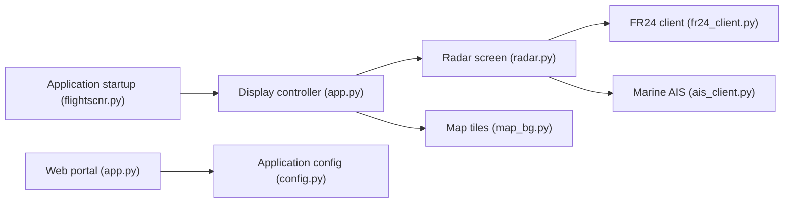

# yashmulgaonkar/FlightScnr_Pi

> Traqueur de vols et de navires sur écran tactile rond Raspberry Pi, pour passionnés d'aviation.

## Le problème
Suivre les avions et bateaux autour de chez soi sur un petit afficheur dédié, sans ordinateur ni terminal pour l'usage quotidien.

## Ce que ça fait vraiment
Affiche un radar sombre animé sur un écran 720×720, avec détail de vol, vol suivi sur carte, horloge et météo. Sources : FR24, adsb.fi, dump1090/readsb local, AIS (aisstream.io), Tomorrow.io, LibreWXR, séismes et feux. Audio LiveATC sur haut-parleur USB ou Bluetooth. Un portail web local sert à la configuration et aux mises à jour OTA.

## Comment c'est branché


## Essayer
```bash
git clone https://github.com/yashmulgaonkar/FlightScnr_Pi.git ~/FlightScnr_Pi
cd ~/FlightScnr_Pi
sudo bash install-pi.sh
```

## Coût et pièges
Matériel : Raspberry Pi et écran Waveshare (câble d'alimentation obligatoire sur le 4-DSI-TOUCH-C). Plusieurs clés d'API gratuites à créer. L'installeur force X11 et redémarre. Le README prévoit un script de réparation à lancer via `curl | bash`.

## Ce que ce n'est pas
Pas libre au sens commercial : le code est sous CC BY-NC-SA 4.0 (usage non commercial, partage à l'identique). L'AIS d'aisstream.io est signalé instable.

## Alternatives
Aucune alternative nommée dans le README (il se dit modelé sur FlightScnr).

## Pour toi
À ignorer : projet matériel de loisir, licence non commerciale, hors de ton périmètre data/IA.

