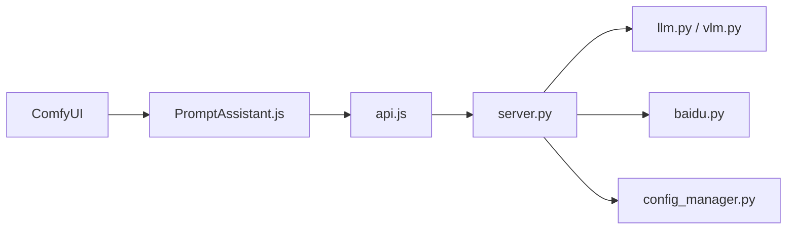

# yawiii/ComfyUI-Prompt-Assistant

> Extension ComfyUI qui optimise, traduit et rétro-décrit des prompts via LLM cloud ou Ollama, pour utilisateurs ComfyUI.

## Le problème
Écrire, traduire et retoucher des prompts d'image à la main dans ComfyUI est répétitif, surtout en bilingue chinois/anglais.

## Ce que ça fait vraiment
Ajoute un petit assistant sur les champs texte des nœuds : expansion et optimisation de prompt, traduction (y compris notes, nœuds Markdown, documentation de nœuds), rétro-description d'image et de vidéo (bêta). Gère tags favoris, historique avec annuler/rétablir, règles personnalisables et plusieurs services (Baidu, Zhipu, xFlow, Ollama, OpenAI-compatible). La configuration utilisateur vit dans `user/default/prompt-assistant`.

## Comment c'est branché


## Essayer
```bash
cd ComfyUI/custom_nodes
git clone https://github.com/yawiii/ComfyUI-Prompt-Assistant.git
# puis redémarrer ComfyUI ; ou installer « Prompt Assistant » via ComfyUI Manager
```

## Coût et pièges
Clé d'API du fournisseur choisi (Baidu, Zhipu, xFlow…) ou Ollama local. Zhipu censure et renvoie du vide sur contenu refusé ; migrer la config avant mise à jour 2.0.

## Ce que ce n'est pas
Pas un générateur d'images : il n'agit que sur le texte autour. README principalement en chinois ; la vidéo-rétro-description est en bêta. L'avertissement du dépôt décline toute responsabilité sur les services tiers.

## Alternatives
Aucune alternative nommée dans le README.

## Pour toi
À surveiller : utile si tu fais beaucoup de ComfyUI avec prompts multilingues, sans intérêt direct pour un pipeline MLOps ; GPL-3.0 et mainteneur unique incitent à ne pas en dépendre.

