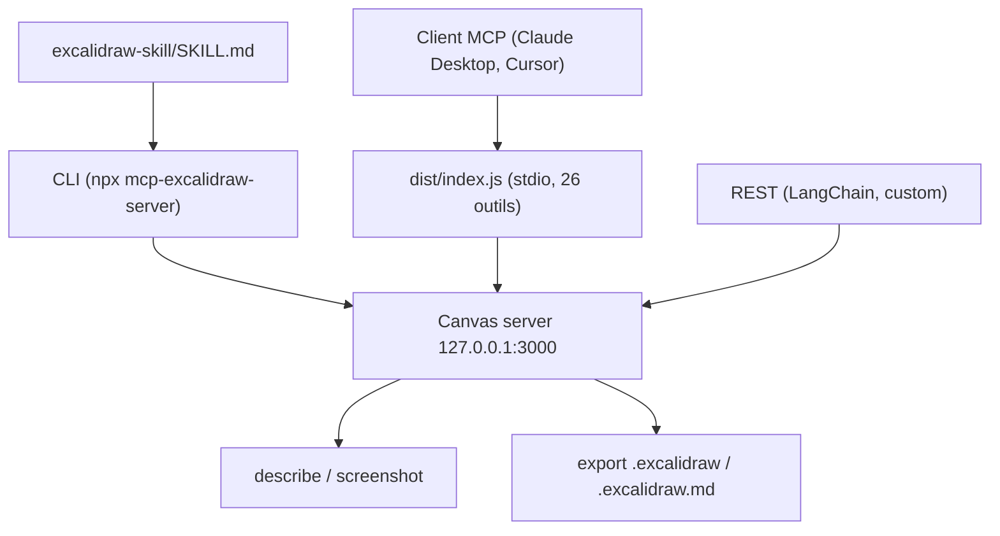

# yctimlin/mcp_excalidraw

> Un canevas Excalidraw local que l'agent de code dessine, regarde, corrige et commite.

## Le problème
Un agent qui « fait un diagramme » sort une image unique : labels tronqués, flèches croisées,
et rien de réutilisable dans le dépôt.

## Ce que ça fait vraiment
Lance un serveur de canevas local (UI Excalidraw + API REST + sync WebSocket sur
`http://127.0.0.1:3000`, auto-démarré depuis la v1.1) pilotable par trois façades : une CLI
composable (JSON en entrée/sortie, codes de sortie utiles), un serveur MCP stdio de 26 outils,
ou du HTTP brut. L'agent crée les éléments un par un, appelle `describe` (résumé textuel) et
`screenshot` (PNG) pour voir son propre travail, corrige, puis `export` un `.excalidraw`
déposé dans le dépôt. Exports déterministes depuis la v2.0 : ids, seeds et ordre des clés
stables, donc pas de faux diffs git.

## Comment c'est branché


## Essayer
```bash
npx -y mcp-excalidraw-server start
open http://127.0.0.1:3000   # browser tab enables screenshots & mermaid
npx -y mcp-excalidraw-server describe
npx -y mcp-excalidraw-server screenshot --out diagram.png
npx -y mcp-excalidraw-server export --out docs/architecture.excalidraw
npx -y mcp-excalidraw-server install-skill --dir <skills-root>
claude mcp add excalidraw --scope user -- npx -y mcp-excalidraw-server
```

## Coût et pièges
Node ≥ 20 obligatoire depuis la v2.0, MIT, pas de clé d'API. Le canevas est **en mémoire** :
redémarrer le serveur efface tout, il faut exporter ou faire un snapshot. Screenshots, export
PNG/SVG, viewport et conversion Mermaid exigent un onglet navigateur ouvert (code de sortie 4
sinon). Le serveur n'a aucune authentification : ne l'expose pas avec `HOST=0.0.0.0` sans
contrôle réseau devant.

## Ce que ce n'est pas
Ce n'est pas le MCP officiel Excalidraw, qui est un widget de chat « prompt in, diagramme
out ». Ici il n'y a pas de génération d'image : l'agent place les éléments. Le partage via
`share` téléverse une scène chiffrée sur excalidraw.com — c'est le seul appel sortant.

## Alternatives
- Le MCP officiel Excalidraw : mieux pour un diagramme jetable dans une conversation.

## Pour toi
Le bon outil pour transformer les schémas d'architecture en artefacts versionnés du dépôt.
