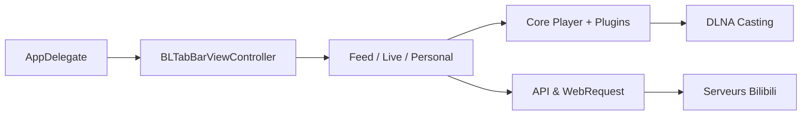

# yichengchen/ATV-Bilibili-demo

> Client tvOS non officiel de Bilibili, en démo, pour regarder vidéos et lives sur Apple TV.

## Le problème
Bilibili n'a pas d'application Apple TV qui réponde à ces usages (danmaku, HDR, projection).

## Ce que ça fait vraiment
Connexion par QR code, flux recommandé, tendances, classements, recherche, historique, direct avec bulles de commentaires (danmaku), HDR, sous-titres et projection « Petit TV ». L'architecture décrit un système de plugins pour le lecteur, un module DLNA et une couche de requêtes vers Bilibili.

## Comment c'est branché

## Essayer
Le README ne donne aucune commande. Il indique un IPA non signé dans la release `nightly` du dépôt.

## Coût et pièges
Gratuit. L'auteur précise qu'aucun TestFlight ni version payante n'existe : toute offre payante n'est pas autorisée. Il dépend de l'API non officielle de Bilibili.

## Ce que ce n'est pas
Pas une application publiée sur l'App Store. Pas un produit officiel de Bilibili. Le README est en chinois.

## Alternatives
Aucune alternative nommée dans le README.

## Pour toi
À ignorer : client vidéo grand public, sans rapport avec ton travail.

