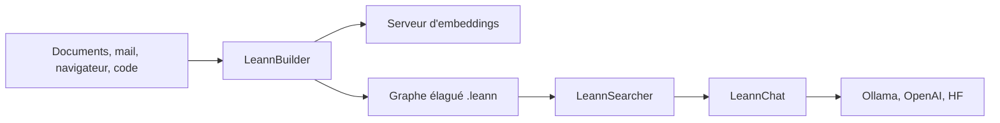

# yichuan-w/LEANN

> Index vectoriel local qui recalcule les embeddings à la demande pour tenir sur un portable.

## Le problème
Un index vectoriel classique stocke chaque embedding : des millions de documents saturent le disque d'un portable.

## Ce que ça fait vraiment
Stocke un graphe élagué (HNSW ou DiskANN) et recalcule les embeddings uniquement pour les nœuds visités. Le README annonce 97 % de stockage économisé (60 M de chunks en 6 Go contre 201 Go). API Builder, Searcher et Chat, CLI (`build`, `search`, `ask`, `watch`), applications RAG (documents, mail, navigateur, iMessage, WeChat, ChatGPT, Claude) et serveur MCP pour Claude Code.

## Comment c'est branché


## Essayer
```bash
uv venv
source .venv/bin/activate
uv pip install leann
leann build my-docs --docs ./your_documents
leann ask my-docs --interactive
```

## Coût et pièges
Gratuit en local (Ollama, modèles HF). OpenAI est le backend LLM par défaut et demande `OPENAI_API_KEY`. Compilation de DiskANN lourde (MKL, boost, protobuf) ; plusieurs apps sont réservées à macOS.

## Ce que ce n'est pas
Recalculer les embeddings coûte du calcul à chaque requête. Les chiffres de stockage et de rappel viennent de l'auteur. Le README annonce zéro télémétrie mais renvoie vers un sondage externe.

## Alternatives
- FAISS : la base vectorielle classique servant de référence de comparaison dans le README.

## Pour toi
À surveiller : intéressant pour du RAG local frugal, mais recalcul à chaque requête et licence non déclarée.
