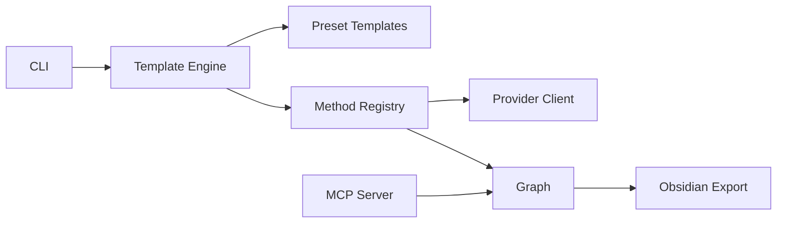

# yifanfeng97/Hyper-Extract

> Outil en ligne de commande qui transforme des documents en graphes de connaissances structurés par modèles YAML.

## Le problème
Extraire entités et relations d'un lot de documents demande de choisir une méthode, d'écrire un schéma et de gérer les mises à jour à la main.

## Ce que ça fait vraiment
`he parse` lit un document (PDF, Word, HTML, EPUB…) avec un modèle YAML parmi plus de 80 (finance, droit, médecine, général) et produit une « abstraction de connaissance » : liste, ensemble, graphe, hypergraphe, graphe temporel ou spatial. Plus de 11 méthodes d'extraction sont disponibles (GraphRAG, LightRAG, KG-Gen…). On interroge avec `he search`, on visualise avec `he show`, on exporte vers Obsidian, GraphML, CSV, JSON-LD ou Cypher. Chaque fait garde sa source : mise à jour, retrait et audit par document. Un serveur MCP (`he-mcp`) expose la recherche et l'export.

## Comment c'est branché


## Essayer
```bash
uv tool install hyperextract
he config init -p openai -k YOUR_OPENAI_API_KEY
he parse examples/en/tesla.md -t general/biography_graph -o ./output/ -l en
he search ./output/ "What are Tesla's major achievements?"
he show ./output/
pip install 'hyperextract[mcp]'
```

## Coût et pièges
Chaque extraction appelle un LLM et un modèle d'embeddings ; le README estime DeepSeek à environ 0,001 à 0,005 $ par page. Un déploiement local via vLLM est possible mais demande un GPU. Le README contient une phrase de miroir AtomGit mentionnant « Agent Reach », sans rapport apparent : signe de copier-coller. Licence non identifiée par GitHub.

## Ce que ce n'est pas
Ce n'est pas un service : tout tourne en local, en appelant tes fournisseurs. Le tableau comparatif du README (avec GraphRAG, LightRAG, KG-Gen, ATOM) est celui de l'auteur, sans mesures. La version affichée est 0.10.3, avant la 1.0.

## Alternatives
- LightRAG : méthode d'extraction et de RAG à graphe déjà intégrée dans l'outil.
- GraphRAG : idem, cité comme méthode disponible et comme point de comparaison.
- KG-Gen : extracteur de graphes disponible dans l'outil.

## Pour toi
À surveiller : pratique pour bâtir un graphe de connaissances à partir de rapports, avec traçabilité des sources ; jeune (créé en janvier 2026), à mainteneur unique et à licence à confirmer.
