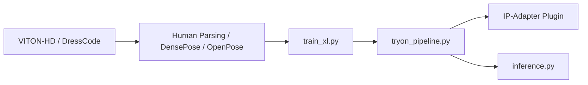

# yisol/IDM-VTON

> Implémentation officielle d'un modèle de diffusion pour l'essayage virtuel de vêtements, pour chercheurs en vision.

## Le problème
Les essayages virtuels par diffusion déforment souvent les vêtements et perdent les détails.

## Ce que ça fait vraiment
Code de l'article : entraînement et inférence sur VITON-HD et DressCode, avec un pipeline SDXL modifié (UNet et attention adaptés) et IP-Adapter. Prétraitement par parsing humain, DensePose et OpenPose. Une démo Gradio locale existe, qui montre DensePose selon le code.

## Comment c'est branché


## Essayer
```bash
git clone https://github.com/yisol/IDM-VTON.git
cd IDM-VTON
conda env create -f environment.yaml
conda activate idm
accelerate launch inference.py --width 768 --height 1024 --num_inference_steps 30 --output_dir "result" --unpaired --data_dir "DATA_DIR" --seed 42 --test_batch_size 2 --guidance_scale 2.0
```

## Coût et pièges
GPU costaud (entraînement avec batch 6, Adam 8 bits). Téléchargement manuel de jeux de données et de checkpoints. Licence non identifiée par GitHub ; dernier push en mars 2025.

## Ce que ce n'est pas
Pas un produit : dépôt de recherche sans API ni empaquetage. Le README ne précise pas les droits d'usage des poids.

## Alternatives
Le README ne nomme aucune alternative.

## Pour toi
À ignorer sauf projet d'essayage virtuel : licence floue, peu actif, mise en route lourde.
