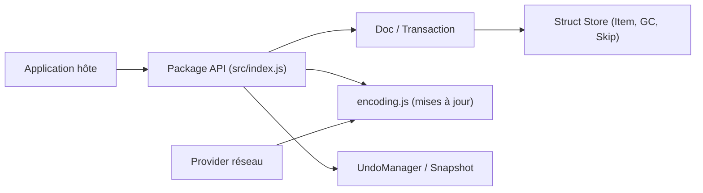

# yjs/yjs

> Bibliothèque CRDT qui expose des types partagés fusionnés sans conflit, pour applications collaboratives.

## Le problème
Synchroniser l'édition simultanée d'un document entre plusieurs personnes, hors ligne compris, sans serveur central de résolution de conflits.

## Ce que ça fait vraiment
Fournit des types partagés (`Y.Array`, `Y.Map`, `Y.Text`, `Y.XmlFragment`…) dont les modifications produisent des mises à jour binaires à échanger et fusionner dans n'importe quel ordre. Indépendant du réseau : le transport (y-websocket, y-webrtc, Hocuspocus…), la persistance (y-indexeddb…) et les liaisons d'éditeurs (ProseMirror, Quill, Monaco…) sont des modules séparés. Gère annulation/rétablissement, instantanés, curseurs partagés et deux formats de mise à jour.

## Comment c'est branché


## Essayer
```sh
npm i yjs y-websocket
PORT=1234 node ./node_modules/y-websocket/bin/server.cjs
```

## Coût et pièges
Gratuit ; support professionnel possible par contrat de sponsoring. Le README avertit que les CRDT de texte ne font que grossir (les tombes ne sont pas toutes purgeables). Licence présente mais non identifiée par GitHub : à vérifier.

## Ce que ce n'est pas
Ce n'est pas un serveur ni une base de données : il faut un fournisseur pour le réseau et la persistance.

## Alternatives
- Automerge : comparé dans les benchmarks crdt-benchmarks cités par le README.

## Pour toi
Surveiller : pertinent pour des notebooks ou éditeurs collaboratifs (JupyterLab l'utilise, selon le README) ; licence à clarifier.

