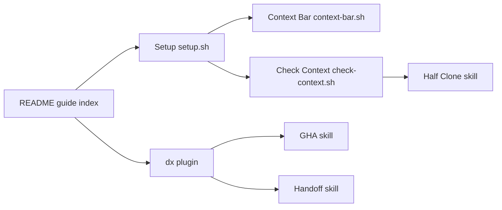

# ykdojo/claude-code-tips

> Guide de 45+ astuces Claude Code, avec scripts et un plugin de skills « dx ».

## Le problème
Claude Code a beaucoup de fonctions (skills, hooks, worktrees, remote control) peu découvrables ; on perd du temps en contexte saturé et en approbations manuelles.

## Ce que ça fait vraiment
Le README est le produit : astuces sur statusline, compaction manuelle par HANDOFF.md, worktrees, conteneurs, TDD, auto mode.
Scripts shell : `context-bar.sh` (barre de statut), `check-context.sh` (hook déclenchant un half-clone à 85 %), clonage de conversations.
Plugin `dx` : skills `/dx:gha` (analyse d'échecs CI), `/dx:handoff`, `/dx:half-clone`, `reddit-fetch`, `review-claudemd`…
Script d'installation interactif qui modifie `settings.json` et le shell.

## Comment c'est branché


## Essayer
```bash
claude plugin marketplace add ykdojo/claude-code-tips
claude plugin install dx@ykdojo
```

## Coût et pièges
Suppose un abonnement ou une clé Claude. Le script de setup désactive par défaut auto-updates et attribution ; relire chaque item. Licence non identifiée.

## Ce que ce n'est pas
Pas une doc officielle : avis personnels, certains dépendants de versions précises de Claude Code. Pas une bibliothèque.

## Alternatives
- Playwright MCP : recommandé comme compagnon pour l'automatisation navigateur.

## Pour toi
À surveiller : les patterns handoff/half-clone et `/gha` sont directement transposables à ton usage quotidien de Claude Code, à piocher plutôt qu'installer en bloc.
