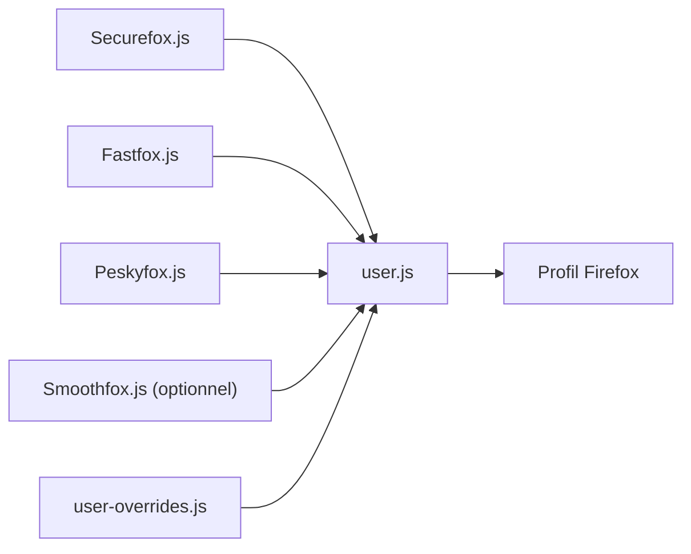

# yokoffing/Betterfox

> Fichier user.js de réglages about:config pour rendre Firefox plus privé et plus fluide, pour utilisateurs avertis.

## Le problème
Les réglages par défaut de Firefox laissent de la télémétrie, des distractions et des paramètres de performance conservateurs, et les régler un par un dans about:config est long.

## Ce que ça fait vraiment
Fournit un `user.js` issu de guides thématiques : Securefox (vie privée), Fastfox (performance), Peskyfox (confort de navigation) et Smoothfox (défilement, optionnel). Le fichier se copie dans le profil Firefox et s'applique au redémarrage ; un `install.py` existe pour les utilisateurs avancés et un `user-overrides.js` permet des surcharges personnelles. Des variantes existent pour Waterfox et Zen.

## Comment c'est branché


## Essayer
```bash
about:profiles
```
Ouvrir le dossier racine du profil, y déposer `user.js`, redémarrer Firefox (étapes du README ; faire d'abord un profil de sauvegarde).

## Coût et pièges
Gratuit. Certains réglages peuvent casser des sites : relire « Common Overrides » et « Optional Hardening ». Le README met en garde contre les faux sites se réclamant de Betterfox.

## Ce que ce n'est pas
Pas un navigateur ni une extension ; et le README rappelle que les forks qui l'intègrent le modifient souvent en réduisant son effet.

## Alternatives
- arkenfox (cité en crédit) : base dont Betterfox reprend le travail, plus strict.
- Firefox-UI-Fix et Narsil/desktop_user.js (cités dans les guides).

## Pour toi
À surveiller : un gain de confort sans lien direct avec ton métier ; à tester sur un profil jetable avant d'adopter.

