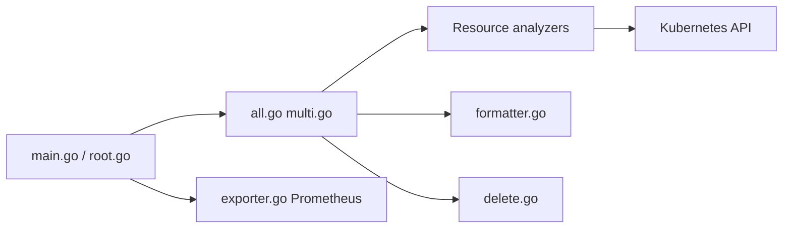

# yonahd/kor

> Outil en ligne de commande qui repère les ressources Kubernetes inutilisées dans un cluster, pour opérateurs.

## Le problème
Les clusters accumulent ConfigMaps, Secrets, PVC et Services orphelins, difficiles à repérer à la main.

## Ce que ça fait vraiment
Sous-commandes par type de ressource (ConfigMaps, Secrets, Services, PVC, Ingress, Roles, CRDs, Pods, Jobs, etc.) et `all`. Sortie table, JSON ou YAML, regroupement par namespace ou ressource, option `--show-reason`. Suppression interactive ou non, étiquettes `kor/used=true|false`, exporteur Prometheus, envoi Slack, déploiement Helm en cronjob.

## Comment c'est branché


## Essayer
```bash
brew install kor
kor all -n test --show-reason
kor configmap --include-namespaces my-namespace --delete
```

## Coût et pièges
Gratuit ; accès kubeconfig au cluster. `--delete --no-interactive` supprime sans demander. Une offre cloud (KorPro) existe pour l'analyse de coûts.

## Ce que ce n'est pas
Pas un outil de coûts ni multi-clusters : cela relève de KorPro, payant. Il détecte l'« inutilisé » par heuristique, à relire avant suppression.

## Alternatives
Aucune alternative nommée dans le README (KorPro est l'offre cloud du même auteur).

## Pour toi
À adopter pour auditer un cluster avant nettoyage : MIT, plusieurs modes d'installation, actif ; garde `--delete` en mode interactif.

