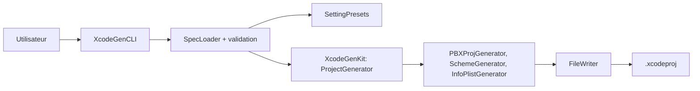

# yonaskolb/XcodeGen

> Outil en ligne de commande Swift qui génère un projet Xcode depuis un fichier de spécification YAML ou JSON.

## Le problème
Les fichiers `.xcodeproj` provoquent des conflits de fusion et se désynchronisent des dossiers sur disque.

## Ce que ça fait vraiment
Lit `project.yml` (cibles, configurations, schémas, réglages, dépendances Carthage, SDK, paquets Swift) et génère le projet Xcode en reflétant l'arborescence. Les specs peuvent être réparties sur plusieurs fichiers. Les groupes de réglages sont partageables, un cache (`--use-cache`) évite de régénérer, et `xcodegen dump` affiche la spec résolue. Le noyau se découpe en modules `ProjectSpec`, `XcodeGenCLI`, `XcodeGenCore` et `XcodeGenKit`.

## Comment c'est branché


## Essayer
```bash
brew install xcodegen
mint install yonaskolb/xcodegen
xcodegen generate
```

## Coût et pièges
Gratuit. Une version stable (non bêta) de Xcode doit être installée. 404 issues ouvertes.

## Ce que ce n'est pas
Ce n'est pas un système de build : il produit le projet Xcode, la compilation reste faite par Xcode.

## Alternatives
Tuist, Xcake et struct sont nommés par le README comme options si XcodeGen ne convient pas.

## Pour toi
Ignorer : utile seulement à qui développe des apps Apple ; rien pour un profil data/IA/MLOps.

