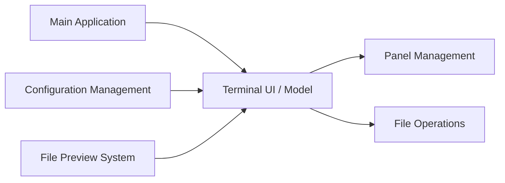

# yorukot/superfile

> Gestionnaire de fichiers en terminal (TUI) en Go, avec panneaux, thèmes et aperçus.

## Le problème
Naviguer et manipuler des fichiers en ligne de commande avec `ls`, `cp` et `mv` est fastidieux.

## Ce que ça fait vraiment
Interface terminal à panneaux, raccourcis clavier (variante vim disponible), thèmes, plugins, aperçu de fichiers (images, PDF), compression et extraction. Vérification automatique de mise à jour au plus une fois par 24 h, désactivable par `auto_check_update`. Le README détaillé renvoie au wiki pour tutoriel, hotkeys et thèmes.

## Comment c'est branché


## Essayer
```bash
bash -c "$(curl -sLo- https://superfile.dev/install.sh)"
winget install --id yorukot.superfile
spf
```

## Coût et pièges
Gratuit. Le script d'installation est téléchargé et exécuté en une ligne : le README invite à l'inspecter. Le contrôle de mise à jour contacte GitHub.

## Ce que ce n'est pas
Ce n'est pas un outil de synchronisation ni un explorateur graphique.

## Alternatives
Aucune alternative nommée dans le README.

## Pour toi
Surveiller : confort utile pour parcourir des jeux de données sur un serveur, sans être indispensable.

