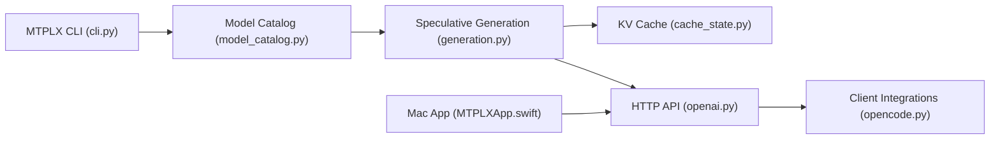

# youssofal/MTPLX

> Application et CLI Mac qui accélèrent les LLM locaux avec les têtes de prédiction multi-tokens du modèle.

## Le problème
Les LLM locaux sur Apple Silicon décodent lentement, et les astuces de vitesse changent souvent la distribution de sortie.

## Ce que ça fait vraiment
Le modèle propose plusieurs tokens, une passe batchée les vérifie, et un échantillonnage par rejet exact les valide : la distribution reste celle du modèle. Gains mesurés par l'auteur : 1,6x sur un Mac mini M4 16 Go, 2,24x sur M5 Max. Il sert une API compatible OpenAI et Anthropic en local, plus embeddings et reranking, avec auto-réglage de la profondeur, forge de modèles MTP et tableau de bord.

## Comment c'est branché


## Essayer
```bash
brew install youssofal/mtplx/mtplx
mtplx start
mtplx serve --model Youssofal/Qwen3.8-Flash-Next-MTPLX-Optimized-Speed
mtplx tune --retune
```

## Coût et pièges
Apple Silicon et macOS 14+. Le plus gros modèle pèse 115 Go (environ 83 Go résidents) et exige un Mac de 96 Go ou plus ; le 27B tient dès 32 Go. Le contrôle des ventilateurs demande un mot de passe sudo.

## Ce que ce n'est pas
Pas un projet CUDA : MLX et Apple Silicon uniquement (vLLM pour Linux). Les vitesses sont mesurées par l'auteur.

## Alternatives
- llama.cpp, Ollama, LM Studio, mlx-lm : comparés par l'auteur sur mtplx.com/compare.

## Pour toi
À surveiller : intéressant si tu fais tourner des LLM sur Mac, sinon sans objet ; l'exactitude de l'échantillonnage est le vrai argument.

