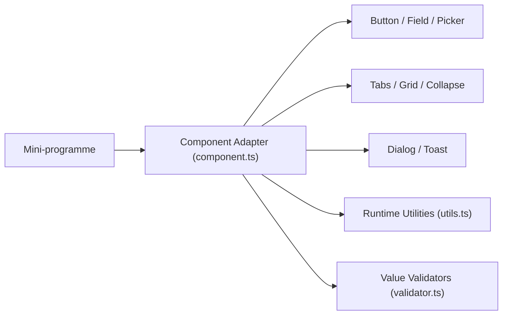

# youzan/vant-weapp

> Bibliothèque de composants d'interface pour mini-programmes WeChat, destinée aux développeurs front-end chinois.

## Le problème
Construire une interface de mini-programme WeChat à la main oblige à réécrire boutons, formulaires, sélecteurs et dialogues dans le format imposé par la plateforme.

## Ce que ça fait vraiment
Fournit des composants personnalisés WeChat (Button, Field, Picker, Calendar, Cascader, Uploader, Tabs, Dialog, Toast…) à déclarer dans `usingComponents` puis à utiliser en WXML. Une couche commune gère l'adaptation des composants, les utilitaires, la validation et les relations entre composants. Base minimale : bibliothèque de mini-programme 2.6.5. README en chinois uniquement.

## Comment c'est branché


## Essayer
```bash
npm i @vant/weapp -S --production
npm install
npm run dev
```

## Coût et pièges
Gratuit (MIT). Il faut les outils développeur WeChat et un mini-programme ; l'exemple publié n'est pas à jour à cause de la revue WeChat.

## Ce que ce n'est pas
Pas une bibliothèque web généraliste : elle ne tourne que dans l'écosystème des mini-programmes WeChat. Les versions Vue 2/3 sont des projets distincts.

## Alternatives
- Version Vue de Vant (citée dans le README) : pour une application web mobile et non un mini-programme.
- Version React et version Alipay maintenues par la communauté (citées dans le README).

## Pour toi
À ignorer pour un profil data/IA/MLOps : c'est de l'UI de mini-programme WeChat, sans rapport avec les données ni le déploiement de modèles.

