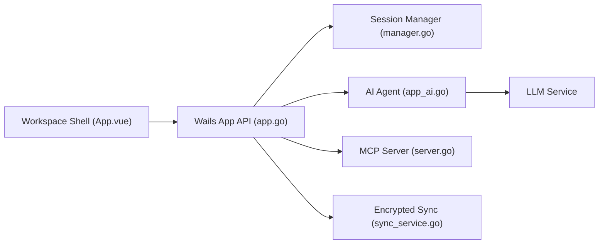

# ys-ll/uniterm

> Terminal tout-en-un pour accès distants (SSH, SFTP, bases, Kubernetes) avec agent IA et serveur MCP.

## Le problème
Les accès distants sont éclatés entre terminal, client SFTP, client de base de données et outils de conteneurs.

## Ce que ça fait vraiment
Application de bureau Wails/Go avec Vue : SSH/Telnet/série, transfert de fichiers, bureau distant, clients de bases, Docker/Kubernetes, supervision serveur. Un agent IA planifie et exécute des commandes dans le terminal actif (API Anthropic ou compatible OpenAI), avec modes de contrôle. Un serveur MCP laisse des agents externes utiliser les connexions sauvegardées. Synchronisation via dépôt Git privé ou WebDAV.

## Comment c'est branché


## Essayer
```bash
brew install --cask ys-ll/uniterm/uniterm
scoop bucket add uniterm https://github.com/ys-ll/scoop-uniterm && scoop install uniterm
git clone https://github.com/ys-ll/uniterm.git
cd frontend && npm install && cd ..
wails3 build
```

## Coût et pièges
Fournisseur LLM et clé à ta charge pour l'agent. Exécutable non signé : faux positifs antivirus possibles. Le build exige wails3 v3.0.0-beta.27.

## Ce que ce n'est pas
Pas un agent sûr par défaut : choisis le mode d'approbation. Le framework Wails v3 est en bêta.

## Alternatives
Aucune alternative nommée dans le README.

## Pour toi
À surveiller : l'agent et le serveur MCP intéressent un profil MLOps qui administre des serveurs, mais le projet a cinq mois d'âge.

