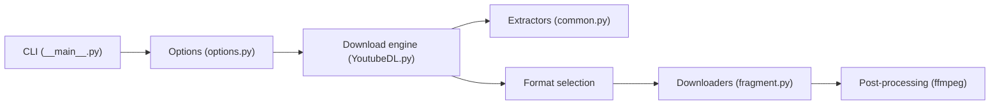

# yt-dlp/yt-dlp

> Téléchargeur audio et vidéo en ligne de commande, pour des milliers de sites, utilisable aussi comme module Python.

## Le problème
Récupérer une vidéo ou un flux audio, avec le bon format, les sous-titres et les métadonnées, varie d'un site à l'autre et casse dès que le site change.

## Ce que ça fait vraiment
À partir d'une URL, l'outil extrait les métadonnées et la liste des formats, choisit un format selon un sélecteur (`-f`) ou un tri (`-S`), télécharge (avec reprise, fragments en parallèle), puis post-traite via ffmpeg : extraction audio, sous-titres, vignettes, chapitres, SponsorBlock. Il s'intègre en Python (`YoutubeDL`) et gère des plugins, la config par fichiers et les cookies du navigateur.

## Comment c'est branché


## Essayer
```bash
yt-dlp -U
yt-dlp --update-to nightly
python -m pip install -U --pre "yt-dlp[default]"
yt-dlp -F URL
yt-dlp -t mp3 URL
```

## Coût et pièges
Gratuit. ffmpeg et ffprobe sont fortement recommandés, ainsi qu'un runtime JavaScript (deno recommandé, ou node, bun, QuickJS) pour le support complet de YouTube. Les binaires PyInstaller contiennent du code GPLv3+ : l'ensemble est alors sous GPLv3+ (le dépôt lui-même est Unlicense). Le canal `stable` est souvent périmé ; le README recommande `nightly`.

## Ce que ce n'est pas
Ni un contournement garanti : les sites changent et cassent des extracteurs. Les plugins ne sont pas contrôlés, le README dit de ne les utiliser que si l'on fait confiance au code.

## Alternatives
- youtube-dl : dont yt-dlp est un fork ; à préférer seulement pour Python 2.6+ ou 3.2+, que yt-dlp ne supporte pas.

## Pour toi
À adopter : sous-titres, audio et métadonnées en une ligne de commande, très utile pour constituer un corpus vidéo/audio avant transcription ou analyse.

