# ytdl-org/youtube-dl

> **Command-line program that pulls video, audio and metadata from hundreds of sites.**

## The problem

Without it, grabbing a video published on a web platform means reading the HTML yourself,
rebuilding the real stream URL, handling HLS or DASH, then remuxing separate tracks. Every site
has its own mechanics, and they change without notice.

## What it actually does

The README describes a command-line program that downloads videos from YouTube.com and a few
more sites, requiring only the Python interpreter, version 2.6, 2.7 or 3.2+. It ships one
extractor per site (`--list-extractors` lists them), a format selector (`-f bestvideo+bestaudio/best`
by default since 2015), an output filename template, playlist and date filters, a download
archive file, and post-processing steps. It also exposes a Python API:
`youtube_dl.YoutubeDL(ydl_opts).download([url])`. What it does not do itself: conversion and
muxing, delegated to ffmpeg or avconv; RTMP goes through rtmpdump, MMS and RTSP through mplayer
or mpv.

## How it is wired

```mermaid
flowchart TD
    %% Main flow
    User["User/CLI Interface"]:::io
    User --> CLIMain["CLI Entry (__main__.py)"]:::core
    click User "https://github.com/ytdl-org/youtube-dl/tree/master/bin/youtube-dl"
    click CLIMain "https://github.com/ytdl-org/youtube-dl/blob/master/youtube_dl/__main__.py"

    CLIMain --> ArgParser["Argument Parser (options.py)"]:::core
    click ArgParser "https://github.com/ytdl-org/youtube-dl/blob/master/youtube_dl/options.py"

    ArgParser --> Core["Core Controller (YoutubeDL class)"]:::core
    click Core "https://github.com/ytdl-org/youtube-dl/blob/master/youtube_dl/YoutubeDL.py"

    Core --> Extractors["Extractor Factory & Plugin Modules (~1000+)"]:::plugins
    click Extractors "https://github.com/ytdl-org/youtube-dl/tree/master/youtube_dl/extractor/"

    Extractors <--> Cache["Cache Subsystem"]:::io
    click Cache "https://github.com/ytdl-org/youtube-dl/blob/master/youtube_dl/cache.py"

    Extractors -->|"metadata (info_dict)"| Core

    Core --> FormatSel["Format Selector & Metadata Model"]:::core

    FormatSel -->|"selected formats"| Core

    Core --> Downloader["Downloader Subsystem"]:::io
    click Downloader "https://github.com/ytdl-org/youtube-dl/tree/master/youtube_dl/downloader/"

    Downloader --> FS["File System I/O & Traversal"]:::io
    click FS "https://github.com/ytdl-org/youtube-dl/blob/master/youtube_dl/traversal.py"

    Core --> Postprocessor["Postprocessor Subsystem"]:::io
    click Postprocessor "https://github.com/ytdl-org/youtube-dl/tree/master/youtube_dl/postprocessor/"

    Postprocessor --> FS

    Core --> External["External Tools Integration"]:::exttools
    click External "https://github.com/ytdl-org/youtube-dl/blob/master/youtube_dl/downloader/external.py"
    click External "https://github.com/ytdl-org/youtube-dl/blob/master/youtube_dl/postprocessor/ffmpeg.py"

    External --> FS

    %% Utility layer
    Core --- Utils["Utility Layer"]:::core
    Extractors --- Utils
    Downloader --- Utils
    Postprocessor --- Utils
    click Utils "https://github.com/ytdl-org/youtube-dl/blob/master/youtube_dl/utils.py"
    click Utils "https://github.com/ytdl-org/youtube-dl/blob/master/youtube_dl/compat.py"

    %% Dev & CI subgraph
    subgraph "Dev & CI Tooling"
        direction TB
        DevScripts["Build & Release Scripts"]:::dev
        click DevScripts "https://github.com/ytdl-org/youtube-dl/tree/master/devscripts/"
        Docs["Documentation Sources"]:::dev
        click Docs "https://github.com/ytdl-org/youtube-dl/tree/master/docs/"
        Tests["Tests (unit & integration)"]:::dev
        click Tests "https://github.com/ytdl-org/youtube-dl/tree/master/test/"
        MakefileNode["Makefile & Setup"]:::dev
        click MakefileNode "https://github.com/ytdl-org/youtube-dl/tree/master/Makefile"
        click MakefileNode "https://github.com/ytdl-org/youtube-dl/blob/master/setup.py"
        CIConfig["CI & Build Config"]:::dev
        click CIConfig "https://github.com/ytdl-org/youtube-dl/blob/master/tox.ini"
        click CIConfig "https://github.com/ytdl-org/youtube-dl/blob/master/.github/workflows/ci.yml"
    end

    %% Styles
    classDef core fill:#ffe599,stroke:#333,stroke-width:1px;
    classDef plugins fill:#b6d7a8,stroke:#333,stroke-width:1px;
    classDef io fill:#9fc5e8,stroke:#333,stroke-width:1px;
    classDef exttools fill:#c9c,stroke:#333,stroke-width:1px;
    classDef dev fill:#dddddd,stroke:#333,stroke-width:1px;
```



The diagram comes from the code. The entry point `youtube_dl/__main__.py` goes through
`options.py` for argument parsing, then the `YoutubeDL` class in `YoutubeDL.py` acts as the
controller. It picks the extractor matching the URL among the modules in `youtube_dl/extractor/`
— each implements `_real_extract()` and returns an *info dict* whose `id`, `title` and `url` or
`formats` are, per the README, the mandatory fields. The controller then selects formats, hands
off to `youtube_dl/downloader/`, then to `youtube_dl/postprocessor/`, with `cache.py` for caching
and external binaries invoked through `downloader/external.py` and `postprocessor/ffmpeg.py`.

## Trying it

```bash
sudo -H pip install --upgrade youtube-dl
youtube-dl [OPTIONS] URL [URL...]
```

Other documented installs: `brew install youtube-dl`, `sudo port install youtube-dl`, or the
direct binary download:

```bash
sudo curl -L https://yt-dl.org/downloads/latest/youtube-dl -o /usr/local/bin/youtube-dl
sudo chmod a+rx /usr/local/bin/youtube-dl
```

For development, the README gives `python -m youtube_dl` to run without building anything, and
`python -m unittest discover` or `python test/test_download.py` for the tests.

## Cost and traps

Nothing to pay, no API key, no account: you need a Python interpreter and, for anything involving
conversion, ffmpeg or avconv installed separately — the README notes that without them youtube-dl
falls back to `best`, hence lower quality on YouTube. The real cost is elsewhere: the README itself
says extractors are fragile by nature since they depend on third-party layouts that change, and an
old version shipped by a distribution can stay broken for a long time. `-U` updates the binary,
`pip install -U youtube-dl` the pip install. The advertised Python range (2.6, 2.7, 3.2+) betrays
old code.

## What it is not

It is not a DRM workaround nor a tool for sites dedicated to copyright infringement: the README
explicitly rejects pull requests adding such sites. It is not a video converter either — without
ffmpeg or avconv, no muxing and no audio extraction. It is not a generic scraping library: outside
the existing extractors, the generic extractor is a fallback. And it is not a service: nothing runs
continuously, everything is a CLI invocation.

## Alternatives

No comparable alternative in the catalogue: the suggested neighbours (pydantic/pydantic-ai,
ankitpokhrel/jira-cli, avelino/awesome-go, mozilla/pdf.js) address a different subject. The README
names no competing project; it only cites companions — ffmpeg or avconv for conversion, rtmpdump
for RTMP, mplayer or mpv for MMS and RTSP.

## For you

Useful as an ingestion brick when building an audio or video corpus for transcription or training:
the Python API and `progress_hooks` fit into a pipeline. Worth watching rather than adopting
blindly: the acknowledged fragility of extractors makes a collection run hard to reproduce, so pin
a version and plan for failures.
