# ytdl-org/youtube-dl

> **Programme en ligne de commande qui récupère vidéos, audio et métadonnées depuis des centaines de sites.**

## Le problème

Sans lui, récupérer une vidéo publiée sur une plateforme web suppose de lire soi-même le HTML,
de reconstituer l'URL réelle du flux, de gérer HLS ou DASH, puis de remuxer les pistes séparées.
Chaque site a sa propre mécanique, et elle change sans prévenir.

## Ce que ça fait vraiment

Le README le décrit comme un programme en ligne de commande qui télécharge des vidéos depuis
YouTube.com et d'autres sites, avec l'interpréteur Python 2.6, 2.7 ou 3.2+ pour seul prérequis.
Il embarque un extracteur par site (`--list-extractors` les énumère), un sélecteur de format
(`-f bestvideo+bestaudio/best` par défaut depuis 2015), un gabarit de nom de fichier de sortie,
des filtres de playlist et de date, un fichier d'archive de téléchargement, et des
post-traitements. Il expose aussi une API Python : `youtube_dl.YoutubeDL(ydl_opts).download([url])`.
Ce qu'il ne fait pas lui-même : la conversion et le muxage, délégués à ffmpeg ou avconv ;
RTMP passe par rtmpdump, MMS et RTSP par mplayer ou mpv.

## Comment c'est branché

```mermaid
flowchart TD
    %% Main flow
    User["User/CLI Interface"]:::io
    User --> CLIMain["CLI Entry (__main__.py)"]:::core
    click User "https://github.com/ytdl-org/youtube-dl/tree/master/bin/youtube-dl"
    click CLIMain "https://github.com/ytdl-org/youtube-dl/blob/master/youtube_dl/__main__.py"

    CLIMain --> ArgParser["Argument Parser (options.py)"]:::core
    click ArgParser "https://github.com/ytdl-org/youtube-dl/blob/master/youtube_dl/options.py"

    ArgParser --> Core["Core Controller (YoutubeDL class)"]:::core
    click Core "https://github.com/ytdl-org/youtube-dl/blob/master/youtube_dl/YoutubeDL.py"

    Core --> Extractors["Extractor Factory & Plugin Modules (~1000+)"]:::plugins
    click Extractors "https://github.com/ytdl-org/youtube-dl/tree/master/youtube_dl/extractor/"

    Extractors <--> Cache["Cache Subsystem"]:::io
    click Cache "https://github.com/ytdl-org/youtube-dl/blob/master/youtube_dl/cache.py"

    Extractors -->|"metadata (info_dict)"| Core

    Core --> FormatSel["Format Selector & Metadata Model"]:::core

    FormatSel -->|"selected formats"| Core

    Core --> Downloader["Downloader Subsystem"]:::io
    click Downloader "https://github.com/ytdl-org/youtube-dl/tree/master/youtube_dl/downloader/"

    Downloader --> FS["File System I/O & Traversal"]:::io
    click FS "https://github.com/ytdl-org/youtube-dl/blob/master/youtube_dl/traversal.py"

    Core --> Postprocessor["Postprocessor Subsystem"]:::io
    click Postprocessor "https://github.com/ytdl-org/youtube-dl/tree/master/youtube_dl/postprocessor/"

    Postprocessor --> FS

    Core --> External["External Tools Integration"]:::exttools
    click External "https://github.com/ytdl-org/youtube-dl/blob/master/youtube_dl/downloader/external.py"
    click External "https://github.com/ytdl-org/youtube-dl/blob/master/youtube_dl/postprocessor/ffmpeg.py"

    External --> FS

    %% Utility layer
    Core --- Utils["Utility Layer"]:::core
    Extractors --- Utils
    Downloader --- Utils
    Postprocessor --- Utils
    click Utils "https://github.com/ytdl-org/youtube-dl/blob/master/youtube_dl/utils.py"
    click Utils "https://github.com/ytdl-org/youtube-dl/blob/master/youtube_dl/compat.py"

    %% Dev & CI subgraph
    subgraph "Dev & CI Tooling"
        direction TB
        DevScripts["Build & Release Scripts"]:::dev
        click DevScripts "https://github.com/ytdl-org/youtube-dl/tree/master/devscripts/"
        Docs["Documentation Sources"]:::dev
        click Docs "https://github.com/ytdl-org/youtube-dl/tree/master/docs/"
        Tests["Tests (unit & integration)"]:::dev
        click Tests "https://github.com/ytdl-org/youtube-dl/tree/master/test/"
        MakefileNode["Makefile & Setup"]:::dev
        click MakefileNode "https://github.com/ytdl-org/youtube-dl/tree/master/Makefile"
        click MakefileNode "https://github.com/ytdl-org/youtube-dl/blob/master/setup.py"
        CIConfig["CI & Build Config"]:::dev
        click CIConfig "https://github.com/ytdl-org/youtube-dl/blob/master/tox.ini"
        click CIConfig "https://github.com/ytdl-org/youtube-dl/blob/master/.github/workflows/ci.yml"
    end

    %% Styles
    classDef core fill:#ffe599,stroke:#333,stroke-width:1px;
    classDef plugins fill:#b6d7a8,stroke:#333,stroke-width:1px;
    classDef io fill:#9fc5e8,stroke:#333,stroke-width:1px;
    classDef exttools fill:#c9c,stroke:#333,stroke-width:1px;
    classDef dev fill:#dddddd,stroke:#333,stroke-width:1px;
```



Le diagramme est tiré du code. Le point d'entrée `youtube_dl/__main__.py` passe par
`options.py` pour l'analyse des arguments, puis la classe `YoutubeDL` de `YoutubeDL.py` fait
office de contrôleur. Elle choisit l'extracteur adapté à l'URL parmi les modules de
`youtube_dl/extractor/` — chacun implémente `_real_extract()` et renvoie un *info dict* dont
`id`, `title` et `url` ou `formats` sont, d'après le README, les champs obligatoires. Le
contrôleur sélectionne ensuite les formats, délègue à `youtube_dl/downloader/`, puis à
`youtube_dl/postprocessor/`, avec `cache.py` pour le cache et les binaires externes appelés
via `downloader/external.py` et `postprocessor/ffmpeg.py`.

## Essayer

```bash
sudo -H pip install --upgrade youtube-dl
youtube-dl [OPTIONS] URL [URL...]
```

Autres installations documentées : `brew install youtube-dl`, `sudo port install youtube-dl`,
ou le téléchargement direct du binaire :

```bash
sudo curl -L https://yt-dl.org/downloads/latest/youtube-dl -o /usr/local/bin/youtube-dl
sudo chmod a+rx /usr/local/bin/youtube-dl
```

Côté développement, le README indique `python -m youtube_dl` pour exécuter sans rien construire,
et `python -m unittest discover` ou `python test/test_download.py` pour les tests.

## Coût et pièges

Rien à payer, aucune clé d'API, aucun compte : il faut un interpréteur Python et, pour tout ce
qui touche à la conversion, ffmpeg ou avconv installés à part — le README précise que sans eux
youtube-dl retombe sur `best`, donc une qualité moindre sur YouTube. Le vrai coût est ailleurs :
le README dit lui-même que les extracteurs sont fragiles par nature puisqu'ils dépendent de la
mise en page de tiers qui change, et qu'une version ancienne installée par une distribution peut
rester cassée longtemps. `-U` met à jour le binaire, `pip install -U youtube-dl` l'installation pip.
Les plages de versions Python annoncées (2.6, 2.7, 3.2+) trahissent un code ancien.

## Ce que ce n'est pas

Ce n'est pas un contournement de protection ni un outil pour les sites dédiés à la contrefaçon :
le README refuse explicitement les pull requests ajoutant de tels sites. Ce n'est pas non plus un
convertisseur vidéo — sans ffmpeg ou avconv, pas de muxage ni d'extraction audio. Ce n'est pas
une bibliothèque de scraping générique : hors des extracteurs existants, l'extracteur générique
est un pis-aller. Et ce n'est pas un service : rien ne tourne en continu, tout est un appel CLI.

## Alternatives

Aucune alternative comparable dans le catalogue : les voisins proposés (pydantic/pydantic-ai,
ankitpokhrel/jira-cli, avelino/awesome-go, mozilla/pdf.js) ne traitent pas le même sujet. Le
README ne nomme pas de projet concurrent ; il cite seulement des compléments — ffmpeg ou avconv
pour la conversion, rtmpdump pour RTMP, mplayer ou mpv pour MMS et RTSP.

## Pour toi

Utile comme brique d'ingestion quand on construit un corpus audio ou vidéo pour de la
transcription ou de l'entraînement : l'API Python et les `progress_hooks` s'intègrent dans un
pipeline. À surveiller plutôt qu'à adopter les yeux fermés : la fragilité assumée des extracteurs
rend la reproductibilité d'une collecte incertaine, et il faut épingler une version et prévoir
les échecs.
