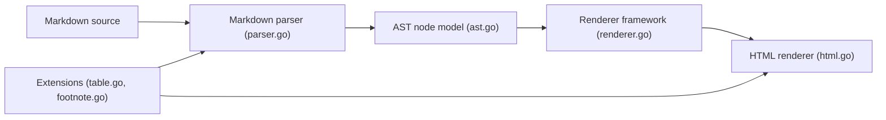

# yuin/goldmark

> Analyseur et convertisseur Markdown en Go conforme CommonMark, extensible, pour développeurs Go.

## Le problème
Les bibliothèques Markdown ne gardent pas toujours la syntaxe d'origine ni de positions, et gèrent mal l'emphase et les sauts de ligne en CJK.

## Ce que ça fait vraiment
Parse le Markdown en un arbre syntaxique qui garde la source de chaque nœud, puis un moteur de rendu séparé produit du HTML. Livre des extensions (tables, barré, listes de tâches, notes de bas de page, listes de définitions, typographie, GFM) et accepte des extensions maison. La v2 (au début de sa diffusion) est une réécriture cassante, avec génériques et AST constructible par programme. Un plugin de migration v1 vers v2 est fourni pour Claude Code. Dépend uniquement de la bibliothèque standard.

## Comment c'est branché


## Essayer
```bash
go get github.com/yuin/goldmark/v2
/plugin marketplace add yuin/goldmark@v2
/plugin install migrate-goldmark-v1-to-v2@yuin-goldmark-v2
```

## Coût et pièges
Gratuit. Beaucoup d'extensions tierces ne supportent pas encore la v2 ; la v1 reste à utiliser dans ce cas.

## Ce que ce n'est pas
Pas un filtre de sécurité : le HTML brut est omis par défaut, mais pour du contenu non fiable le README recommande un assainisseur comme bluemonday.

## Alternatives
- rushdown (cité dans le README) : version Rust.
- Lute et golang-commonmark (comparés dans les benchmarks).

## Pour toi
À ignorer sauf si tu écris du Go : c'est une brique de rendu Markdown, pas un outil d'IA.

